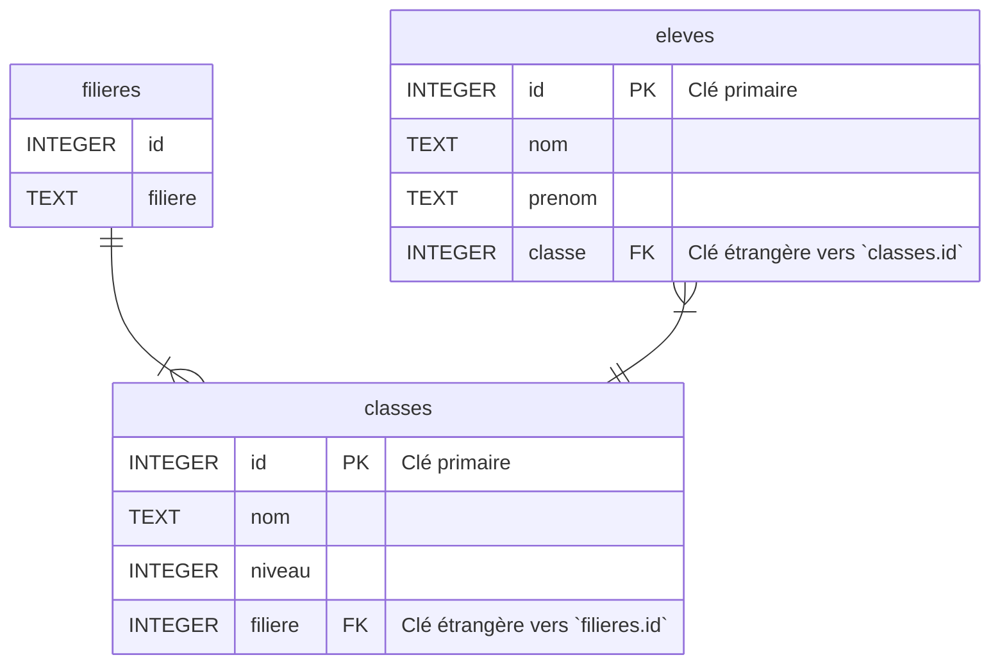

# :school: Base de donnée d'un lycée

On souhaite créer une base de donnée permettant de stocker les informations décrivant les élèves d'un lycée ainsi que leur classe.

Un **élève** est décrit par :

* un identifiant unique (un entier) ;
* son nom ;
* son prénom ;
* sa classe.

Une **classe** est décrite par :

* un identifiant unique (un entier) ;
* son nom (par exemple « Terminale 2 ») ;
* son niveau, nombre entier (2 pour les secondes, 1 pour les premières, 0 pour les terminales) ;
* sa filière (« Générale », « STI2D », *etc*...). Les classes de secondes seront dans la filière « Seconde ».

Afin d'éviter les répétitions dans les tables, les informations sur les filières seront regroupées dans une table séparée.

La structure de la base est donc la suivante :

* Table `filieres` :

    * `id` : identifiant (nombre entier, clé primaire) ;
    * `filiere` : description de la filière (texte).

* Table `classes` :

    * `id` : identifiant (nombre entier, clé primaire) ;
    * `nom` : nom de la classe (texte) ;
    * `niveau` : niveau de la classe (nombre entier) ;
    * `filiere`: filière de la classe (entier, clé étrangère faisant référence à `filieres.id`).

* Table `eleves` :

    * `id` : identifiant (nombre entier, clé primaire) ;
    * `nom` : nom de l'élève (texte) ;
    * `prenom` : prénom de l'élève (texte) ;
    * `classe`: classe de l'élève (entier, clé étrangère faisant référence à `classes.id`).

<!-- 

!!! note "Remarque"

    Ce type de schéma s'appelle un diagramme "Entité - Relation". Il n'est **pas** au programme de la spécialité NSI.

    Les symboles aux extrémités des lien entre les tables indiquent par exemple qu'un élève n'appartient qu'à une seule classe alors qu'une classe contient nécessairement plusieurs élèves.
Comme on peut le voir sur ce schéma :

* l'attribut `id` de la table `eleve` est la clé primaire ;
* l'attribut `classe` de la table `eleve` est une clé étrangère. Cet attribut contient des valeurs faisant références aux `id` de la table `classes`.

La table `classes` contient elle aussi une clé étrangère.
-->

## Création des tables

L'instruction `SQL` permettant de créer la table `filieres` est :

{{ sqlide titre="SQL" base="01_lycee/lycee.db" sql="01_lycee/creation_filieres.sql" espace="lycee"}}

<!-- -->

1. Exécuter cette cellule puis afficher ci-dessous le contenu de la table `filieres`.

    !!! note "Votre réponse"
        {{ sqlide titre="SQL" espace="lycee" }}

    ??? done "Réponse"

        ```sql
        SELECT * 
        FROM filieres;
        ```

        La requête s'est exécutée normalement mais on obtient aucune sortie car la table est vide ! Elle sera peuplée plus bas.

2. Créer la table `classes`.
   
    !!! tip "Déclarer une clé étrangère"

        La déclaration d'une clé étrangère se fait ainsi : `FOREIGN KEY (attribut) REFERENCES table_etrangere (attribut)`.

        Dans le cas présent, on rajoutera donc : `FOREIGN KEY (filiere) REFERENCES filieres (id)`.

    !!! note "Votre réponse"
        {{ sqlide titre="SQL" espace="lycee" }}

    ??? done "Réponse"

        ```sql
        CREATE TABLE classes (
            id INTEGER PRIMARY KEY AUTOINCREMENT,
            nom TEXT,
            niveau INTEGER,
            filiere INTEGER,
            FOREIGN KEY (filiere) REFERENCES filieres (id)
        );
        ```

3. Créer la table `eleves`.
   
    !!! note "Votre réponse"
        {{ sqlide titre="SQL" espace="lycee" }}

    ??? done "Réponse"

        ```sql
        CREATE TABLE eleves (
            id INTEGER PRIMARY KEY AUTOINCREMENT,
            nom TEXT,
            prenom TEXT,
            classe INTEGER,
            FOREIGN KEY (classe) REFERENCES classes (id)
        );
        ```

## Peuplement des tables

Les tables étant créées, il faut désormais les peupler. Nous utiliserons la structure suivante :

```sql
INSERT INTO table (attribut_1, attribut_2, ...)
VALUES (valeur_1, valeur_2, ...), (valeur_1, valeur_2, ...), ...
```

Il ne faut bien entendu pas recopier les points de suspension !

Par exemple pour insérer les filières :

{{ sqlide titre="SQL" sql="01_lycee/insertion_filieres.sql" espace="lycee" }}

4. Exécuter cette cellule puis afficher ci-dessous le contenu de la table `filieres`.

    !!! note "Votre réponse"
        {{ sqlide titre="SQL" espace="lycee" }}

    ??? done "Réponse"

        ```sql
        SELECT * 
        FROM filieres;
        ```

        Cette fois-ci on a bien un résultat.

    
5. On se propose de créer trois classes :
    * la Seconde 1,
    * la Première 2 (de filière « STI2D »),
    * la Terminale 3 (de filière « Générale »).
    
    Une classe est caractérisée par les attributs `id`, `nom`, `niveau` et `filiere`. 
    
    L'`id` étant la **clé primaire** et auto-incrémentée, elle est gérée automatiquement par le système de gestion de la base de données. Il n'est donc pas nécessaire d'insérer les `id`.
    
    L'attribut `filiere` est quant à lui une **clé étrangère**. On ne peut donc pas utiliser la valeur `'STI2D'` pour cet attribut lors de l'insertion de la Première 2. Il faut utiliser la valeur correspondant à la clé étrangère de référence dans la table `filieres`. 

    Si par exemple on constate que dans la table `filieres`, `STI2D` est associé à l'`id` `4` on fera : `INSERT INTO classes (nom, niveau, filiere) VALUES ('Première 2', 1, 4)`. On a fourni `4` comme valeur de l'attribut `filiere`.
    
    Insérer les valeurs dans la table `classes`. 

    !!! note "Votre réponse"
        {{ sqlide titre="SQL" espace="lycee" }}

    ??? done "Réponse"

        On considère que la filière « Seconde » a pour `id` le `1`, `2` pour « Générale » et `4` pour « STI2D ».

        ```sql
        INSERT INTO classes (nom, niveau, filiere)
        VALUES ("Seconde 1", 2, 1), ("Première 2", 1, 4), ("Terminale 3", 0, 2);
        ```

6. Insérer les élèves suivants dans la base :

    |  Nom  |  Prénom  |   Classe    |
    | :---: | :------: | :---------: |
    | Faux  |   Marc   | Terminale 3 |
    | Bidon |   Paul   | Première 2  |
    | Fake  |  Marie   |  Seconde 1  |
    | False | Isabelle | Première 2  |


    !!! note "Votre réponse"
        {{ sqlide titre="SQL" espace="lycee" }}

    ??? done "Réponse"

        On considère que la classe « Seconde 1" a pour `id` le `1`, `2` pour « Première 2" et `3` pour `Terminale 3`.

        ```sql
        INSERT INTO eleves (nom, prenom, classe)
        VALUES ("Faux", "Marc", 3), ("Bidon", "Paul", 2), ("Fake", "Marie", 1), ("False", "Isabelle", 2);
        ```
        
## Mise à jour de valeurs

Le proviseur du lycée souhaite changer la dénomination des classes : il souhaite utiliser des lettres à la place des numéros.

Il faut donc mettre à jour les données. La structure d'une instruction `SQL` de mise à jour est : `UPDATE table SET attribut = nouvelle_valeur WHERE condition`.

Par exemple, pour renommer la « Seconde 1" en « Seconde A" :

{{ sqlide titre="SQL" sql="01_lycee/maj_classes.sql" espace="lycee" }}

1. Mettre à jour les autres noms de classes : « Première 2" devient « Première B", « Terminale 3" devient « Terminale C".
    
    !!! tip "Astuce"

        Il est possible de saisir plusieurs instructions à la suite en les séparant avec un `;`
    
    !!! note "Votre réponse"
        {{ sqlide titre="SQL" espace="lycee" }}

    ??? done "Réponse"

        ```sql
        UPDATE classes SET nom = "Première B" WHERE nom = "Première 2";
        UPDATE classes SET nom = "Terminale C" WHERE nom = "Terminale 3";
        ```