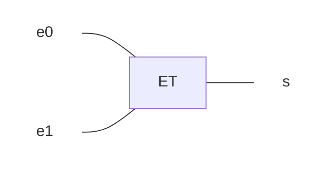
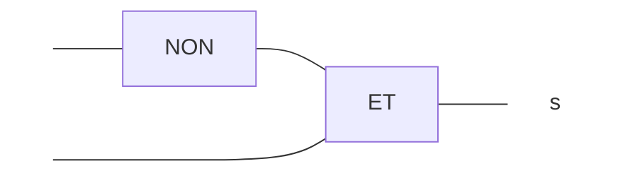
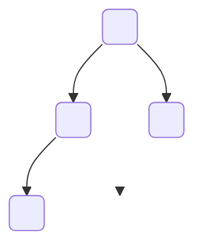
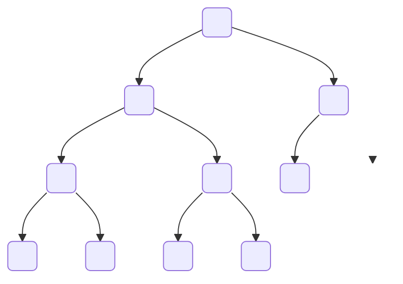

# 2022, Polynésie

BACCALAURÉAT GÉNÉRAL, NSI, 2022, Polynésie

Durée de l'épreuve : 3 heures 30  
L'usage de la calculatrice avec mode examen actif est autorisé.  
L'usage de la calculatrice sans mémoire, « type collège » est autorisé.

Le candidat traite au choix 3 exercices parmi les 5 exercices
proposés.

!!! warning "Sujet non officiel"
    Ce n'est pas le sujet officiel, quelques modifications mineures ont été apportées.

    Le sujet d'origine est disponible en [téléchargement](JIPO1.pdf).

## EXERCICE 1 (4 points)

> Cet exercice traite du thème « programmation », et principalement de la récursivité.

On rappelle qu'une chaine de caractères peut être représentée en Python par un texte entre guillemets `""` et que :

- la fonction `len` renvoie la longueur de la chaine de caractères passée en
paramètre ;
- si une variable `ch` désigne une chaine de caractères, alors `ch[0]` renvoie son premier caractère, `ch[1]` le deuxième, etc ;
- l'opérateur `+` permet de concaténer deux chaines de caractères.

!!! example "Exemples"
    ```pycon
    >>> texte = "bricot"
    >>> len(texte)
    6
    >>> texte[0]
    "b"
    >>> texte[1]
    "r"
    >>> "a" + texte
    "abricot"
    ```

On s'intéresse dans cet exercice à la construction de chaines de caractères suivant certaines règles de construction.

!!! info "Règle A"
    Une chaine est construite suivant la règle A dans les deux cas suivants :

    - soit elle est égale à `"a"` ;
    - soit elle est de la forme `"a" + chaine + "a"`, où `chaine` est une chaine de caractères construite suivant la règle A.

!!! info "Règle B"
    Une chaine est construite suivant la règle B dans les deux cas suivants :

    - soit elle est de la forme `"b" + chaine + "b"`, où `chaine` est une chaine de caractères construite suivant la règle A ;
    - soit elle est de la forme `"b" + chaine + "b"`, où `chaine` est une chaine de caractères construite suivant la règle B.

!!! tip "Fonction `choice` du module `random`"
    On a reproduit ci-dessous l'aide de la fonction `choice` du module `random`.

    ```pycon
    >>> from random import choice
    >>> help(choice)
    Help on method choice in module random:
    choice(seq) method of random.Random instance
    Choose a random element from a non-empty sequence.
    ```

La fonction `A` ci-dessous renvoie une chaine de caractères construite suivant la règle A, en choisissant aléatoirement entre les deux cas de figure de cette règle.


```python
def A():
    if choice([True, False]):
        return "a"
    else:
        return "a" + A() + "a"
```

**1.a)** Cette fonction est-elle récursive ? Justifier.

??? done "Réponse"
    La fonction `A` s'appelle elle-même, donc `A` est une fonction récursive.

**1.b)** La fonction `choice([True, False])` peut renvoyer `False` un très grand
nombre de fois consécutives. Expliquer pourquoi ce cas de figure amènerait à
une erreur d'exécution.

??? done "Réponse"
    Si `choice([True, False])` renvoie `False` consécutivement un nombre de fois supérieur à la limite de profondeur de récursion autorisée (1000 par défaut avec Python), dans ce cas une erreur d'exécution se produit.

    !!! danger "Pour aller plus loin"
        On pourrait modifier cette limite à $10^6$ avec le code suivant

        ```python
        import sys
        sys.setrecursionlimit(10**6)
        ```

Dans la suite, on considère une deuxième version de la fonction `A`. À présent, la fonction prend en paramètre un entier `n` tel que,

- si la valeur de `n` est négative ou nulle, la fonction renvoie `"a"` ;
- si la valeur de `n` est strictement positive, elle renvoie une chaine de caractères construite suivant la règle A avec un `n` décrémenté de 1, en choisissant aléatoirement entre les deux cas de figure de cette règle.


```python
def A(n):
    if ... or choice([True, False]) :
        return "a"
    else:
        return "a" + ... + "a"
```

**2.a)** Recopier sur la copie et compléter aux emplacements des points de
suspension `...` le code de cette nouvelle fonction `A`.

??? done "Réponse"

    ```python
    def A(n):
        if n <= 0 or choice([True, False]) :
            return "a"
        else:
            return "a" + A(n - 1) + "a"
    ```


**2.b)** Justifier le fait qu'un appel de la forme `A(n)` avec `n` un nombre entier positif inférieur à 50, termine toujours.

??? done "Réponse"
    Pour $n > 0$, l'appel à `A(n)` provoque ou bien un arrêt de la fonction, ou bien un appel récursif avec le paramètre `n - 1`.

    Un appel à `A(50)` pourrait provoquer dans le pire des cas 50 appels récursifs pour arriver à `A(0)` qui termine, ou alors terminer avant !

On donne ci-après le code de la fonction récursive B qui prend en paramètre un entier `n` et qui renvoie une chaine de caractères construite suivant la règle B.

```python
def B(n):
    if n <= 0 or choice([True, False]):
        return "b" + A(n - 1) + "b"
    else:
        return "b" + B(n - 1) + "b"
```

On admet que :

- les appels `A(-1)` et `A(0)` renvoient la chaine `"a"` ;
- l'appel `A(1)` renvoie la chaine `"a"` ou la chaine `"aaa"` ;
- l'appel `A(2)` renvoie la chaine `"a"`, la chaine `"aaa"` ou la chaine `"aaaaa"`.

**3.** Donner toutes les chaines possibles renvoyées par les appels `B(0)`, `B(1)` et `B(2)`.

??? done "Réponse"
    - `B(0)` renvoie `"bab"`
    - `B(1)` renvoie `"bab"` ou `"bbabb"`.
    - `B(2)` renvoie `"bab"`, `"baaab"`, `"bbabb"` ou `"bbbabbb"`.

On suppose maintenant qu'on dispose d'une fonction `raccourcir` qui prend comme paramètre une chaine de caractères de longueur supérieure ou égale à 2, et renvoie la chaine de caractères obtenue à partir de la chaine initiale en lui ôtant le premier et le dernier caractère.

!!! example "Par exemple :"

    ```pycon
    >>> raccourcir("abricot")
    "brico"
    >>> raccourcir("ab")
    ""
    ```

**4.a)** Recopier sur la copie et compléter les points de suspension `...` du code de la fonction `regle_A` ci-dessous pour qu'elle renvoie `True` si la chaine passée en paramètre est construite suivant la règle A, et `False` sinon.

```python
def regle_A(chaine):
    n = len(chaine)
    if n >= 2:
        return chaine[0] == "a" and chaine[n - 1] == "a" and regle_A(...)
    else:
        return chaine == ...
```

??? done "Réponse"
    ```python
    def regle_A(chaine):
        n = len(chaine)
        if n >= 2:
            return chaine[0] == "a" and chaine[n - 1] == "a" and regle_A(raccourcir(chaine))
        else:
            return chaine == "a"
    ```

**4.b)** Écrire le code d'une fonction `regle_B`, prenant en paramètre une chaine de caractères et renvoyant `True` si la chaine est construite suivant la règle B, et `False` sinon.

??? done "Réponse"

    ```python
    def regle_B(chaine):
        n = len(chaine)
        if n >= 2:
            return chaine[0] == "b" and chaine[n - 1] == "b" and (
                regle_A(chaine[1 : n - 1]) or regle_B(raccourcir(chaine))
            )
        else:
            return False
    ```


## EXERCICE 2 (4 points)

> Cet exercice traite du thème « architecture matérielle », et principalement d'ordonnancement et d'expressions booléennes.

Un système est composé de 4 périphériques, numérotés de 0 à 3, et d'une mémoire, reliés entre eux par un bus auquel est également connecté un dispositif ordonnanceur. À l'aide d'un signal spécifique envoyé sur le bus, l'ordonnanceur sollicite à tour de rôle les périphériques pour qu'ils indiquent le type d'opération (lecture ou écriture) qu'ils souhaitent effectuer, et l'adresse mémoire concernée.

Un tour a lieu quand les 4 périphériques ont été sollicités. **Au début d'un nouveau tour, on considère que toutes les adresses sont disponibles en lecture et écriture.**

Si un périphérique demande l'écriture à une adresse mémoire **à laquelle on n'a pas encore accédé** pendant le tour, l'ordonnanceur répond `"OK"` et l'écriture a lieu. Si on a déjà demandé la lecture ou l'écriture à cette adresse, l'ordonnanceur répond `"ATT"` et l'opération n'a pas lieu.

Si un périphérique demande la lecture à une adresse à laquelle on n'a pas encore accédé en écriture pendant le tour, l'ordonnanceur répond `"OK"` et la lecture a lieu. Plusieurs lectures peuvent avoir donc lieu pendant le même tour à la même adresse.

Si un périphérique demande la lecture à une adresse à laquelle on a déjà accédé en écriture, l'ordonnanceur répond `"ATT"` et la lecture n'a pas lieu.

Ainsi, pendant un tour, une adresse peut être utilisée soit une seule fois en écriture, soit autant de fois qu'on veut en lecture, soit pas utilisée.

Si un périphérique ne peut pas effectuer une opération à une adresse, il demande la même opération à la même adresse au tour suivant.

**1.** Le tableau donné en annexe 1 indique, sur chaque ligne, le périphérique sélectionné, l'adresse à laquelle il souhaite accéder et l'opération à effectuer sur cette adresse. Compléter dans la dernière colonne de cette annexe, à rendre avec la copie, la réponse donnée par l'ordonnanceur pour chaque opération.


!!! abstract "Annexe 1"

    |N° périphérique | Adresse | Opération | Réponse de l'ordonnanceur |
    |:---|:---|:---|:---|
    | 0 | `10` | écriture | `"OK"` |
    | 1 | `11` | lecture  | `"OK"` |
    | 2 | `10` | lecture  | `"ATT"` |
    | 3 | `10` | écriture | `"ATT"` |
    | 0 | `12` | lecture  |  |
    | 1 | `10` | lecture  |  |
    | 2 | `10` | lecture  |  |
    | 3 | `10` | écriture |  |

??? done "Réponse"
    TODO

    |N° périphérique | Adresse | Opération | Réponse de l'ordonnanceur |
    |:---|:---|:---|:---|
    | 0 | `10` | écriture | `"OK"` |
    | 1 | `11` | lecture  | `"OK"` |
    | 2 | `10` | lecture  | `"ATT"` |
    | 3 | `10` | écriture | `"ATT"` |
    | 0 | `12` | lecture  |  `"OK"`|
    | 1 | `10` | lecture  |  `"OK"`|
    | 2 | `10` | lecture  | `"OK"` |
    | 3 | `10` | écriture | `"ATT"` |


On suppose dans toute la suite que :

- le périphérique 0 écrit systématiquement à l'adresse 10 ;
- le périphérique 1 lit systématiquement à l'adresse 10 ;
- le périphérique 2 écrit alternativement aux adresses 11 et 12 ;
- le périphérique 3 lit alternativement aux adresses 11 et 12 ;

Pour les périphériques 2 et 3, le changement d'adresse n'est effectif que lorsque l'opération et réalisée.


**2.** On suppose que les périphériques sont sélectionnés à chaque tour dans l'ordre 0 ; 1 ; 2 ; 3. Expliquer ce qu'il se passe pour le périphérique 1.

??? done "Réponse"
    Le périphérique 1 ne pourra jamais effectuer sa lecture à l’adresse mémoire 10 puisque juste avant le périphérique 0 aura effectué une écriture à l’adresse mémoire 10.

Les périphériques sont sollicités de la manière suivante lors de quatre tours successifs :

- au premier tour, ils sont sollicités dans l'ordre 0 ; 1 ; 2 ; 3 ;
- au deuxième tour, dans l'ordre 1 ; 2 ; 3 ; 0 ;
- au troisième tour, 2 ; 3 ; 0 ; 1 ;
- puis 3 ; 0 ; 1 ; 2 au dernier tour.
- Et on recommence...

**3.a)** Préciser pour chacun de ces tours si le périphérique 0 peut écrire et si le périphérique 1 peut lire.

??? done "Réponse"
    
    - tour 1 : 0 peut écrire ; 1 ne peut pas lire  
    - tour 2 : 0 ne peut pas écrire ; 1 peut lire  
    - tour 3 : 0 peut écrire ; 1 ne peut pas lire  
    - tour 4 : 0 peut écrire ; 1 ne peut pas lire

**3.b)** En déduire la proportion des valeurs écrites par le périphérique 0 qui sont effectivement lues par le périphérique 1.

??? done "Réponse"
    0 peut écrire trois fois et 1 peut lire une seule fois, seulement un tiers des valeurs écrites par 0 sont lues par 1, soit 33%


On change la méthode d'ordonnancement : on détermine l'ordre des périphériques au cours d'un tour à l'aide de deux listes d'attente `ATTL_L` et `ATT_E` établies au tour précédent.


Au cours d'un tour, on place dans la liste `ATT_L` toutes les opérations de lecture mises en attente, et dans la liste d'attente `ATT_E` toutes les opérations d'écriture mises en attente.


Au début du tour suivant, on établit l'ordre d'interrogation des périphériques en procédant ainsi :

- on interroge ceux présents dans la liste `ATT_L`, par ordre croissant d'adresse,
- on interroge ensuite ceux présents dans la liste `ATT_E`, par ordre croissant
d'adresse,
- puis on interroge les périphériques restants, par ordre croissant d'adresse.

**4.** Compléter et rendre avec la copie le tableau fourni en annexe 2, en utilisant l'ordonnancement décrit ci-dessus, sur 3 tours.

!!! abstract "Annexe 2"

    | Tour | N° périphérique | Adresse | Opération | Réponse ordonnanceur | `ATT_L` | `ATT_E` |
    |:---|:---|:---|:---|:---|:---|:---|
    | 1 | 0 | `10` | écriture | `"OK"`  | vide      | vide |
    | 1 | 1 | `10` | lecture  | `"ATT"` | `(1, 10)` | vide |
    | 1 | 2 | `11` | écriture |         |           |      |
    | 1 | 3 | `11` | lecture  |         |           |      |
    | 2 | 1 | `10` | lecture  |         |           | vide |
    | 2 |   |      |          |         |           |      |
    | 2 |   |      |          |         |           |      |
    | 2 |   |      |          |         |           |      |
    | 3 | 0 | `10` | écriture |         | vide      | vide |
    | 3 | 1 | `10` | lecture  |         |           | vide |
    | 3 | 2 | `11` | écriture | `"OK"`  | `(1, 10)` | vide |
    | 3 | 3 | `12` | lecture  |         |           |      |

??? done "Réponse"

   | Tour | N° périphérique | Adresse | Opération | Réponse ordonnanceur | `ATT_L` | `ATT_E` |
    |:---|:---|:---|:---|:---|:---|:---|
    | 1 | 0 | `10` | écriture | `"OK"`  | vide      | vide |
    | 1 | 1 | `10` | lecture  | `"ATT"` | `(1, 10)` | vide |
    | 1 | 2 | `11` | écriture | `"OK"`  | `(1, 10)` |      |
    | 1 | 3 | `11` | lecture  | `"ATT"` | `(1, 10)` `(3, 11)` | vide |
    | 2 | 1 | `10` | lecture  | `"OK"`  | `(3, 11)` | vide |
    | 2 | 3 | `11` | lecture  | `"OK"`  |   vide    | vide |
    | 2 | 0 | `10` | lecture  | `"ATT"` |   vide    |`(0, 10)` |
    | 2 | 2 | `12` | écriture | `"OK"`  |   vide    |`(0, 10)`  |
    | 3 | 0 | `10` | écriture | `"OK"`  | vide      | vide |
    | 3 | 1 | `10` | lecture  | `"ATT"` | `(1, 10)` | vide |
    | 3 | 2 | `11` | écriture | `"OK"`  | `(1, 10)` | vide |
    | 3 | 3 | `12` | lecture  | `"OK"`  | `(1, 10)` | vide |

Les colonnes **e0** et **e1** du tableau suivant recensent les deux chiffres de l'écriture binaire de l'entier **n** de la première colonne.

| nombre n | écriture binaire de n sur deux bits | e1 | e0 |
|:--------:|:-----------------------------------:|:--:|:--:|
|0|00|0|0|
|1|01|0|1|
|2|10|1|0|
|3|11|1|1|

L'ordonnanceur attribue à deux signaux sur le bus de données les valeurs de **e0** et **e1** associées au numéro du circuit qu'il veut sélectionner. On souhaite construire à l'aide des portes ET, OU et NON un circuit pour chaque périphérique.  
Chacun des quatre circuits à construire prend en entrée deux signaux **e0** et **e1**, le signal de sortie **s** valant 1 uniquement lorsque les niveaux de **e0** et **e1** correspondent aux bits de l'écriture en binaire du numéro du périphérique correspondant.


Par exemple, le circuit ci-dessous réalise la sélection du périphérique 3. En effet, le signal **s** vaut 1 si et seulement si **e0** et **e1** valent tous les deux 1.




**5.a)** Recopier sur la copie et indiquer dans le circuit ci-dessous les entrées **e0** et **e1** de façon à ce que ce circuit sélectionne le périphérique 1.



??? done "Réponse"

    ```mermaid
    flowchart LR
        ea(e1)---NON---ET
        eb(e0)----ET
        ET---s
        style ea stroke-width:0px,opacity:0
        style eb stroke-width:0px,opacity:0
        style s stroke-width:0px,opacity:0
    ```

**5.b)** Dessiner un circuit constitué d'une porte ET et d'une porte NON, qui sélectionne le périphérique 2.

??? done "Réponse"

    ```mermaid
    flowchart LR
        ea(e1)----ET
        eb(e0)---NON---ET
        ET---s
        style ea stroke-width:0px,opacity:0
        style eb stroke-width:0px,opacity:0
        style s stroke-width:0px,opacity:0
    ```


**5.c)** Dessiner un circuit permettant de sélectionner le périphérique 0.

??? done "Réponse"

    ```mermaid
    flowchart LR
        ea(e0)---NON 
        eb(e1)---NON
        NON---ET 
        NON---ET   
        ET---s
        style ea stroke-width:0px,opacity:0
        style eb stroke-width:0px,opacity:0
        style s stroke-width:0px,opacity:0
    ```


## EXERCICE 3 (4 points)

> Cet exercice traite du thème « base de données », et principalement du modèle relationnel et du langage SQL.

L'énoncé de cet exercice peut utiliser les mots du langage SQL suivants :

`    CREATE TABLE, SELECT, FROM, WHERE, JOIN ON, INSERT INTO, VALUES, UPDATE, SET, DELETE, COUNT, DISTINCT, AND, OR, AS, ORDER BY, ASC, DESC`

Un site web recueille des données de navigation dans une base de données afin d'étudier les profils de ses visiteurs.  
Chaque requête d'interrogation d'une page de ce site est enregistrée dans une première table dénommée **Visites** sous la forme d'un 5-uplet : `(identifiant, adresse IP, date et heure de visite, nom de la page, navigateur)`.

Le chargement de la page `index.html` par `192.168.1.91` le 12 juillet 1998 à 22 h 48 aura par exemple été enregistré de la façon suivante :

`(1534, "192.168.1.91", "1998-07-12 22:48:00", "index.html", "Internet explorer 4.1")`.

La commande SQL ayant permis de créer cette table est la suivante :

```sql
CREATE TABLE Visites (
    identifiant INTEGER NOT NULL UNIQUE,
    ip VARCHAR(15),
    dateheure DATETIME,
    nompage TEXT,
    navigateur TEXT
);
```

**1.a)** Donner une commande d'interrogation en langage SQL permettant d'obtenir l'ensemble des 2-uplets `(adresse IP, nom de la page)` de cette table.

??? done "Réponse"

    ```sql
    SELECT ip,nompage
    FROM Visites
    ```


**1.b)** Donner une commande en langage SQL permettant d'obtenir l'ensemble des adresses IP ayant interrogé le site, sans doublon.

??? done "Réponse"

    ```sql
    SELECT DISTINCT ip
    FROM Visites
    ```


**1.c)** Donner une commande en langage SQL permettant d'obtenir la liste des noms des pages visitées par l'adresse IP `192.168.1.91`

??? done "Réponse"
    ```sql
    SELECT DISTINCT nompage
    FROM Visites
    WHERE ip="192.168.1.91"
    ```


Ce site web met en place, sur chacune de ses pages, un programme en JavaScript qui envoie au serveur, à intervalle régulier de 15 secondes, le temps en secondes de présence sur la page. Ces envois contiennent tous la valeur de `identifiant` correspondant au chargement initial de la page.  
Par exemple, si le visiteur du 12 juillet 1998 est resté 65 secondes sur la page, celle-ci a envoyé au serveur les 4 doublets `(1534, 15)`, `(1534, 30)`, `(1534, 45)` et `(1534, 60)`.

Ces données sont enregistrées dans une table nommée `Pings` créée avec la commande ci-dessous :

```sql
CREATE TABLE Pings (
    identifiant INTEGER,
    duree INTEGER
);
```

En plus de l'inscription d'une ligne dans la table `Visites`, chaque chargement d'une nouvelle page provoque l'insertion d'une ligne dans la table `Pings` comprenant l'identifiant de ce chargement et une durée de 0.

Les attributs `identifiant` des tables `Visites` et `Pings` partagent les mêmes valeurs.

**2.a)** De quelle table l'attribut `identifiant` est-il la clé primaire ?

??? done "Réponse"
    l'attribut `identifiant` est la clé primaire de la table `Visistes (id)`

**2.b)** De quelle table l'attribut `identifiant` est-il une clé étrangère ?

??? done "Réponse"
    l'attribut `identifiant` est la clé étrangère de la table `Pings`

**2.c)** Par conséquent, quelles vérifications sont automatiquement effectuées par le système de gestion de base de données ?

??? done "Réponse"
    Le SGBD va vérifier que l’attribut identifiant est unique pour chaque p-upplet de la table Visites. Le SGBD va aussi vérifier que l’attribut identifiant de la table Pings correspond bien à un attribut identifiant de la table Visites pour chaque p-upplet de la table Pings.

**3.** Le serveur reçoit le doublet `(identifiant, duree)` suivant : `(1534, 105)`. Écrire la commande SQL d'insertion qui permet d'ajouter cet enregistrement à la table `Pings`.

??? done "Réponse"
    
    ```sql
    INSERT INTO Pings 
    (identifiant, duree)
    VALUES (1534, 105)
    ```


On envisage ensuite d'optimiser la table en se contentant d'une seule ligne par identifiant dans la table `Pings` : les valeurs de l'attribut `duree` devraient alors être mises à jour à chaque réception d'un nouveau doublet `(identifiant, duree)`.

**4.a)** Écrire la requête de mise à jour permettant de fixer à 120 la valeur de l'attribut `duree` associée à l'identifiant 1534 dans la table `Pings`.

??? done "Réponse"

    ```sql
    UPDATE Pings 
    SET duree = 120 
    WHERE identifiant = 1534
    ```

**4.b)** Expliquer pourquoi on ne peut pas être certain que les données envoyées par une page web, depuis le navigateur d'un client, via plusieurs requêtes formulées en JavaScript, arrivent au serveur dans l'ordre dans lequel elles ont été émises.

??? done "Réponse"
   Nous ne pouvons pas être certains que les données envoyées par une page web, depuis le navigateur d’un client, via plusieurs requêtes formulées en JavaScript, arrivent au serveur dans l’ordre dans lequel elles ont été émises, car les paquets de données (protocole TCP/IP) n’emprunteront pas forcément le même chemin pour aller du client vers le serveur (ou même certains paquets de données pourront se “perdre” et devront être réémis par le client). Les requêtes HTTP étant constitués de paquets de données, il n’est donc pas possible de garantir l’ordre d’arrivée des requêtes HTTP.


**4.c)** En déduire qu'il est préférable d'utiliser une requête d'insertion plutôt qu'une requête de mise à jour pour ajouter des données à la table `Pings`.

??? done "Réponse"
    Imaginons que le client envoie 2 requêtes HTTP A et B (le client envoie la requête A puis la requête B). Si le serveur, en recevant la requête B tente de mettre à jour l’entrée correspondant à la requête A alors qu’il n’a pas encore reçu la requête A, cela va entrainer une erreur (tente de mettre à jour une entrée qui n’existe pas).


**5.** Écrire une requête SQL utilisant le mot-clé `JOIN` et une clause `WHERE`, permettant de trouver les noms de toutes les pages qui ont été consultées plus d'une minute par au moins un utilisateur.

??? done "Réponse"

    ```sql
    SELECT nompage 
    FROM Visites 
    JOIN Pings ON Visites.identifiant = Pings.identifiant 
    WHERE duree > 60
    ```


## EXERCICE 4 (4 points)

> Cet exercice traite du thème « structures de données », et principalement des piles.

La classe `Pile` utilisée dans cet exercice est implémentée en utilisant des listes Python et propose quatre éléments d'interface :

- Un constructeur qui permet de créer une pile vide, représentée par `[]` ;
- La méthode `est_vide()` qui renvoie `True` si l'objet est une pile ne contenant aucun élément, et `False` sinon ;
- La méthode `empiler` qui prend un objet quelconque en paramètre et ajoute cet objet au sommet de la pile. Dans la représentation de la pile dans la console, cet objet apparait à droite des autres éléments de la pile ;
- La méthode `depiler` qui renvoie l'objet présent au sommet de la pile et le retire de la pile.

!!! example "Exemples :"

    ```pycon
    >>> ma_pile = Pile()
    >>> ma_pile.empiler(2)
    >>> ma_pile
    [2]
    >>> ma_pile.empiler(3)
    >>> ma_pile.empiler(50)
    >>> ma_pile
    [2, 3, 50]
    >>> ma_pile.depiler()
    50
    >>> ma_pile
    [2, 3]
    ```

La méthode `est_triee` ci-dessous renvoie `True` si, en dépilant tous les éléments, ils sont traités dans l'ordre croissant, et `False` sinon.

```python linenums="1"
def est_triee(self):
    if not self.est_vide():
        e1 = self.depiler()
        while not self.est_vide():
            e2 = self.depiler()
            if e1 ... e2 :
                return False
            e1 = ...
    return True
```

**1.** Recopier sur la copie les lignes 6 et 8 en complétant les points de suspension.

??? done "Réponse"

    ```python linenums="1"
    def est_triee(self):
        if not self.est_vide():
            e1 = self.depiler()
            while not self.est_vide():
                e2 = self.depiler()
                if e1 > e2 :
                    return False
                e1 = e2
        return True
    ```


On crée dans la console la pile `A` représentée par `[1, 2, 3, 4]`.

**2.a)** Donner la valeur renvoyée par l'appel `A.est_triee()`.

??? done "Réponse"
    La valeur $4$ est d'abord dépilée, puis $3$. L'ordre n'est pas croissant, ainsi `A.est_triee()` renvoie `False`.

**2.b)** Donner le contenu de la pile `A` après l'exécution de cette instruction.

??? done "Réponse"

    `A` sera représenté par `[1, 2]`.

On souhaite maintenant écrire le code d'une méthode `depile_max` d'une pile non vide ne contenant que des nombres entiers et renvoyant le plus grand élément de cette pile en le retirant de la pile.

Après l'exécution de `p.depile_max()`, le nombre d'éléments de la pile `p` diminue donc de 1.


```python linenums="1"
def depile_max(self):
    assert not self.est_vide(), "Pile vide"
    q = Pile()
    maxi = self.depiler()
    while not self.est_vide():
        elt = self.depiler()
        if maxi < elt:
            q.empiler(maxi)
            maxi = ...
        else :
            ...
    while not q.est_vide():
        self.empiler(q.depiler())
    return maxi
```

**3.** Recopier sur la copie les lignes 9 et 11 en complétant les points de suspension.

??? done "Réponse"

    ```python linenums="1"
    def depile_max(self):
        assert not self.est_vide(), "Pile vide"
        q = Pile()
        maxi = self.depiler()
        while not self.est_vide():
            elt = self.depiler()
            if maxi < elt:
                q.empiler(maxi)
                maxi = elt
            else :
                q.empiler(elt)
        while not q.est_vide():
            self.empiler(q.depiler())
        return maxi
    ```


On crée la pile `B` représentée par `[9, -7, 8, 12, 4]` et on effectue l'appel `B.depile_max()`.

**4.a)** Donner le contenu des piles `B` et `q` à la fin de chaque itération de la boucle `#!py while` de la ligne 5.

??? done "Réponse"
    === "Initialisation"
        - `B` contient `[9, -7, 8, 12]` ;
        - `q` est vide ;
        - `maxi` est égal à `4`.

        Juste avant le premier tour de boucle

    === "Fin du tour 1"
        - `B` contient `[9, -7, 8]` ;
        - `q` contient `[4]` ;
        - `maxi` est égal à `12`.

    === "Fin du tour 2"
        - `B` contient `[9, -7]` ;
        - `q` contient `[4, 8]` ;
        - `maxi` est égal à `12`.

    === "Fin du tour 3"
        - `B` contient `[9]` ;
        - `q` contient `[4, 8, -7]` ;
        - `maxi` est égal à `12`.
    
    === "Fin du tour 4"
        - `B` est vide ;
        - `q` contient `[4, 8, -7, 9]` ;
        - `maxi` est égal à `12`.

**4.b)** Donner le contenu des piles `B` et `q` avant l'exécution de la ligne 14.

??? done "Réponse"
    La dernière boucle renverse la pile `q` dans la pile `B`, ainsi, à la ligne 14 :

    - `q` est vide ;
    - `B` contient `[9, -7, 8, 4]`.


**4.c)** Donner un exemple de pile qui montre que l'ordre des éléments restants n'est pas préservé après l'exécution de `depile_max`.

??? done "Réponse"
    Avec une pile `B` qui contient `[3, 1, 2]`

    === "Initialisation"
        - `B` contient `[3, 1]` ;
        - `q` est vide ;
        - `maxi` est égal à `2`.

        Juste avant le premier tour de boucle

    === "Fin du tour 1"
        - `B` contient `[3]` ;
        - `q` contient `[1]` ;
        - `maxi` est égal à `2`.

    === "Fin du tour 2"
        - `B` est vide ;
        - `q` contient `[1, 2]` ;
        - `maxi` est égal à `3`.

    La dernière boucle renverse la pile `q` dans la pile `B`, ainsi, à la ligne 14 :

    - `q` est vide ;
    - `B` contient `[2, 1]`.

    Sans `3` dans la pile `B` initiale, on a dans l'ordre `[1, 2]` ce qui est différent de `[2, 1]` obtenu ici avec `depile_max`.

    On a ainsi un exemple où l'ordre des éléments restants n'est pas préservé après l'exécution de `depile_max`.


On donne le code de la méthode `traiter` :

```python linenums="1"
def traiter(self):
    q = Pile()
    while not self.est_vide():
        q.empiler(self.depile_max())
    while not q.est_vide():
        self.empiler(q.depiler())
```

**5.a)** Donner les contenus successifs des piles `B` et `q`

- avant la ligne 3,
- avant la ligne 5,
- à la fin de l'exécution de la fonction `traiter` lorsque la fonction `traiter` est appelée avec la pile `B` contenant `[1, 6, 4, 3, 7, 2]`.

??? done "Réponse"
    Avec `B = [1, 6, 4, 3, 7, 2]`, un appel `B.traiter()` conduit successivement à :

    - Avant la ligne 3,
        - `B` contient `[1, 6, 4, 3, 7, 2]` ;
        - `q` est vide.
    - Avant la ligne 5,
        - `B` est vide ;
        - `q` contient `[7, 6, 4, 3, 2, 1]`
    - À la fin,
        - `B` contient `[1, 2, 3, 4, 6, 7]`
        - `q` est vide.

**5.b)** Expliquer le traitement effectué par cette méthode.

??? done "Réponse"
    Ce traitement est un tri de la pile. On construit d'abord `q` comme la pile des éléments de `self` dans l'ordre décroissant. On renverse ensuite la pile, qui se retrouve comme si on avait empilé les éléments de `self` dans l'ordre croissant.


## EXERCICE 5 (4 points)

> Cet exercice traite du thème « algorithmique », et principalement des algorithmes sur les arbres binaires.

On manipule ici les arbres binaires avec trois fonctions :

- `est_vide(A)` renvoie `True` si l'arbre binaire `A` est vide, `False` s'il ne l'est pas ;
- `sous_arbre_gauche(A)` renvoie le sous-arbre à gauche de l'arbre binaire `A` ;
- `sous_arbre_droite(A)` renvoie le sous-arbre à droite de l'arbre binaire `A`.

L'arbre binaire renvoyé par les fonctions `sous_arbre_gauche` et `sous_arbre_droite` peut éventuellement être l'arbre vide.

On définit la hauteur d'un arbre binaire non vide de la façon suivante :

- si ses sous-arbres à gauche et à droite sont vides, sa hauteur est $0$ ;
- si l'un des deux au moins est non vide, alors sa hauteur est égale à $1 + M$, où $M$ est la plus grande des hauteurs de ses sous-arbres (à gauche et à droite) non vides.

**1.a)** Donner la hauteur de l'arbre ci-dessous.



??? done "Réponse"
    Avec cette définition, la hauteur de cet arbre binaire est 2.

**1.b)** Dessiner sur la copie un arbre binaire de hauteur $4$.

??? done "Réponse"
    Avec cette définition, voici un arbre binaire de hauteur $4$.

    ```mermaid
    graph TD
        N0( ) --> N1( )
        N0   --> N2( )
        N1  --> N3( )
        N1  --> N4( )
        N2  --> N5( )
        N2  --> N6( )
        N4  --> N7( )
        N4  --> N8( )
        N7  --> N9( )
        N7  --> N10( )
        linkStyle 7 stroke-width:0px;
        style N8 opacity:0;
        linkStyle 4 stroke-width:0px;
        style N5 opacity:0;
    ```


La hauteur d'un arbre est calculée par l'algorithme récursif suivant :

```text title="Pseudo Code", linenums="1"
Algorithme hauteur(A) :
    test d'assertion : A est supposé non vide
    si sous_arbre_gauche(A) vide et sous_arbre_droite(A) vide :
        renvoyer 0
    sinon, si sous_arbre_gauche(A) vide :
        renvoyer 1 + hauteur(sous_arbre_droite(A))
    sinon, si ... :
        renvoyer ...
    sinon:
        renvoyer 1 + max(
            hauteur(sous_arbre_gauche(A)),
            hauteur(sous_arbre_droite(A))
        )
```

**2.** Recopier sur la copie les lignes 7 et 8 en complétant les points de suspension.

??? done "Réponse"
    ```text title="Pseudo Code", linenums="1"
    Algorithme hauteur(A) :
        test d'assertion : A est supposé non vide
        si sous_arbre_gauche(A) vide et sous_arbre_droite(A) vide :
            renvoyer 0
        sinon, si sous_arbre_gauche(A) vide :
            renvoyer 1 + hauteur(sous_arbre_droite(A))
        sinon, si sous_arbre_droite(A) vide :
            renvoyer 1 + hauteur(sous_arbre_gauche(A))
        sinon:
            renvoyer 1 + max(
                hauteur(sous_arbre_gauche(A)),
                hauteur(sous_arbre_droite(A))
            )
    ```

    !!! danger "Pour aller plus loin"
        Si on définit la hauteur d'un arbre binaire vide égale à 0, (celle d'un arbre réduit à un seul nœud égal à 1), on a un algorithme bien plus simple, et qui traite tous les cas :

        ```text title="Pseudo Code", linenums="1"
        Algorithme hauteur(A) :
            si A vide :
                renvoyer 0
            sinon:
                renvoyer 1 + max(
                    hauteur(sous_arbre_gauche(A)),
                    hauteur(sous_arbre_droite(A))
                )
        ```


On considère un arbre binaire `R` dont on note `G` le sous-arbre à gauche et `D` le
sous-arbre à droite. On suppose que `R` est de hauteur $4$ et `G` de hauteur $2$.

**3.a)** Justifier le fait que `D` n'est pas l'arbre vide et déterminer sa hauteur.

??? done "Réponse"
    Si `D` est égal à l'arbre vide, alors la hauteur de `R` est égale à `1 + hauteur(G)` qui est égal à $1+2=3$, or `R` est de hauteur $4$. Contradiction.

    Ainsi `D` n'est pas l'arbre vide.
    
    Dans ce cas `1 + max(hauteur(G), hauteur(D))` est égal à $4$. D'où

    - `1 + max(2, hauteur(D))` est égal à $4$.
    - `max(2, hauteur(D))` est égal à $3$.
    - `hauteur(D)` est égal à $3$.


**3.b)** Illustrer cette situation par un dessin.

??? done "Réponse"
    - Cet arbre est de hauteur $4$,
    - son sous arbre à gauche est de hauteur $2$,
    - son sous arbre à droite est de hauteur $3$.

    ```mermaid
    graph TD
        N0( ) --> N1( )
        N0   --> N2( )
        N1  --> N3( )
        N1  --> N4( )
        N2  --> N5( )
        N2  --> N6( )
        N4  --> N7( )
        N4  --> N8( )
        N6  --> N9( )
        N6  --> N10( )
        N9  --> N11( )
        N9  --> N12( )
        linkStyle 7 stroke-width:0px;
        style N8 opacity:0;
        linkStyle 4 stroke-width:0px;
        style N5 opacity:0;
    ```


Soit un arbre binaire non vide de hauteur `h`. On note `n` le nombre de nœuds de cet arbre. On admet que $h + 1 \leqslant n \leqslant 2^{h+1} - 1$.

**4.a)** Vérifier ces inégalités sur l'arbre binaire de la question **1.a)**.

??? done "Réponse"
    Dans la question **1.a)**, l'arbre binaire possède $n = 4$ nœuds et a une hauteur $h = 2$.

    On a bien $2 + 1 \leqslant 4 \leqslant 2^{2+1}$ qui s'écrit aussi $3 \leqslant 4 \leqslant 8$

**4.b)** Expliquer comment construire un arbre binaire de hauteur `h` quelconque ayant `h+1` nœuds.

??? done "Réponse"
    Il **suffit**, par exemple, de construire un arbre binaire où pour chaque nœud, soit le sous arbre à gauche est vide, soit celui à droite.

    - Cela peut être toujours celui à gauche qui est vide, on parle alors d'arbre peigne à droite.
    - Cela peut être toujours celui à droite qui est vide, on parle alors d'arbre peigne à gauche.

**4.c)** Expliquer comment construire un arbre binaire de hauteur `h` quelconque ayant $2^{h+1} - 1$ nœuds.

> _Indication_ : $2^{h+1} - 1 = 1+2+4+...+2^h$.

??? done "Réponse"
    Il **faut**, dans ce cas, construire un arbre binaire complet ; les sous-arbres vides sont tous à la même profondeur.

??? danger "Pour aller plus loin"
    Avec l'autre définition de la hauteur, l'inégalité s'écrit $h \leqslant n \leqslant 2^h - 1$, et elle est encore valable pour l'arbre binaire vide. C'est plus simple et général.


L'objectif de la fin de l'exercice est d'écrire le code d'une fonction `fabrique(h, n)` qui prend comme paramètres deux nombres entiers positifs `h` et `n` tels que $h + 1 < n < 2^{h+1} - 1$, et qui renvoie un arbre binaire de hauteur `h` à `n` nœuds.

Pour cela, on utilise les deux fonctions suivantes :

- `arbre_vide()`, qui renvoie un arbre vide ;
- `arbre(gauche, droite)` qui renvoie l'arbre de fils à gauche `gauche` et de fils
à droite `droite`.

**5.** Recopier sur la copie l'arbre binaire ci-dessous et numéroter ses nœuds de 1 en 1 en commençant à 1, en effectuant un parcours en profondeur préfixe.



??? done "Réponse"

    ```mermaid
    graph TD
        N0(1) --> N2(9)
        N0   --> N1(2)
        N1 --> N3(3)
        N1 --> N4(6)
        N2  --> N5(10)
        N2  --> N6( )
        linkStyle 5 stroke-width:0px;
        style N6 opacity:0;
        N3 --> N7(4)
        N3 --> N8(5)
        N4 --> N9(7)
        N4 --> N10(8)
    ```

La fonction `fabrique` ci-dessous a pour but de répondre au problème posé. Pour cela, la fonction `annexe` utilise la valeur de `n`, qu'elle peut modifier et renvoie un arbre
binaire de hauteur `hauteur_max` dont le nombre de nœuds est égal à la valeur de `n` au
moment de son appel.

```python linenums="1"
def fabrique(h, n):
    def annexe(hauteur_max):
        if n == 0:
            return arbre_vide()
        elif hauteur_max == 0:
            n = n - 1
            return ...
        else:
            n = n - 1
            gauche = annexe(hauteur_max - 1)
            droite = ...
        return arbre(gauche, droite)
    return annexe(h)
```

**6.** Recopier sur la copie les lignes 7 et 11 en complétant les points de suspension.

??? done "Réponse"

    ```python linenums="1"
    def fabrique(h, n):
        def annexe(hauteur_max):
            if n == 0:
                return arbre_vide()
            elif hauteur_max == 0:
                n = n - 1
                return arbre(arbre_vide(), arbre_vide())
            else:
                n = n - 1
                gauche = annexe(hauteur_max - 1)
                droite = arbre_vide()
            return arbre(gauche, droite)
        return annexe(h)
    ```
