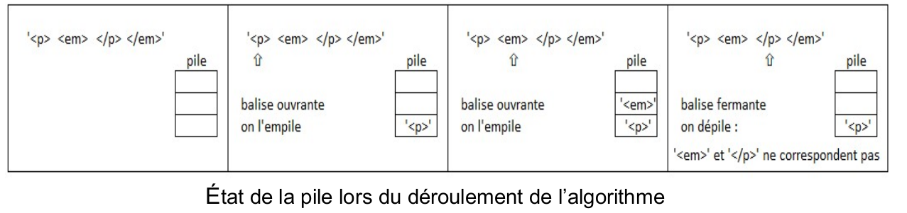
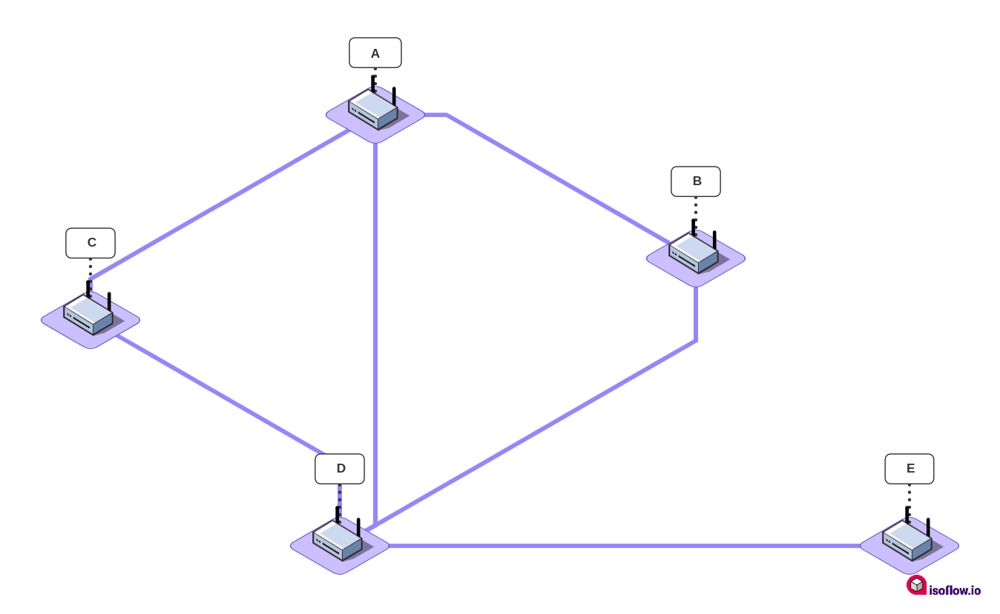
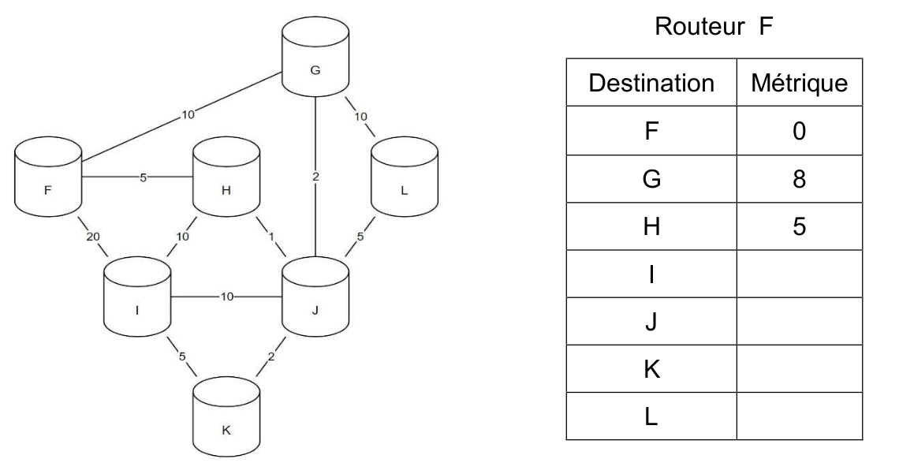

<table  class="greenTable">
        <tr>
            <th>
            Thème  : Epreuve Ecrite BAC
            </th>
        </tr>
</table>
<br>
<table  class="greenTable">
        <tr >
            <th width="20%"; style="background-color: #3B444B;color:white;text-align:center;border:none;font-size:40pt;">
            BAC
            </th>
            <th  width="80%"; style="text-align:center;border:none;font-size:25pt;">France J1 2022</th>
        </tr>
</table>
<br>


## Exercice I : 

**_Cet exercice composé de deux parties A et B, porte sur les structures de données._**

**Partie A : Expression correctement parenthésée**


On veut déterminer si une expression arithmétique est correctement parenthésée.  
Pour chaque parenthèse fermante ")" correspond une parenthèse précédemment ouverte "(".  
Exemples :

- L’expression arithmétique "(2 + 3) × (18/(4 + 2))" est correctement parenthésée.  
- L’expression arithmétique "(2 + 3) × (18/(4 + 2" est non correctement parenthésée.  

Pour simplifier les expressions arithmétiques, on enregistre, dans une structure de données, uniquement les parenthèses dans leur ordre d’apparition. On appelle expression simplifiée cette structure. 


!!! fabquestion "1)"
    Indiquer si la phrase « les éléments sont maintenant retirés (pour être lus) de cette structure de données dans le même ordre qu’ils y ont été ajoutés lors de l’enregistrement » décrit le comportement d’une file ou d’une pile. Justifier.  
  
??? done "Réponse"
    La  phrase  décrit  le  comportement  d’une **file**  puisque  le premier élément entré est aussi le premier élément qui sera lu **(first in first out)**.  

Pour vérifier le parenthésage, on peut utiliser une variable controleur qui : 
- est un nombre entier égal à 0 en début d’analyse de l’expression simplifiée ;  
- augmente de 1 si l’on rencontre une parenthèse ouvrante "(" ;  
- diminue de 1 si l’on rencontre une parenthèse fermante ")".  

Exemple : On considère l’ expression simplifiée A : "( )( ( ) )"  
Lors de l’analyse de l’expression A, controleur (initialement égal à 0) prend successivement pour valeur 1, 0, 1, 2, 1, 0. Le parenthésage est correct.  


!!! fabquestion "2)" 
    Écrire, pour chacune des 2 expressions simplifiées B et C suivantes, les valeurs successives prises par la variable controleur lors de leur analyse.  
    Expression simplifiée B : " ((( )( )"  
    Expression simplifiée C : "(( )))("  


??? done "Réponse"
    - Pour   l’expression   B,   la   variable   contrôleur   prend successivement les valeurs: 1, 2, 3, 2, 3, 2  
    - Pour  l’expression  C,  la  variable  contrôleur  prend successivement les valeurs: 1, 2, 1, 0, -1, 0  

!!! fabquestion "3)" 
    L’expression simplifiée B précédente est mal parenthésée (parenthèses fermantes manquantes) car le controleur est différent de zéro en fin d’analyse.  
    L’expression simplifiée C précédente est également mal parenthésée (parenthèse fermante sans parenthèse ouvrante) car le controleur prend une valeur négative pendant l’analyse.  
    Recopier et compléter uniquement les lignes 13 et 16 du code ci-dessous pour que la fonction parenthesage_correct réponde à sa description.

```py linenums="1"
def parenthesage_correct(expression):
    ''' fonction retournant True si l'expression arithmétique 
    simplifiée (str) est correctement parenthésée, False
    sinon.
    Condition: expression ne contient que des parenthèses
    ouvrantes et fermantes'''
    controleur = 0
    for parenthese in expression: #pour chaque parenthèse
        if parenthese == '(':
            controleur = controleur + 1
        else:# parenthese == ')'
            controleur = controleur - 1
            if controleur ...: # test 1 (à recopier et compléter)
                #parenthèse fermante sans parenthèse ouvrante
                return False
    if controleur ... : # test 2 (à recopier et compléter)
        return True #le parenthésage est correct
    else:
        return False #parenthèse(s) fermante(s) manquante(s)
```

??? done "Réponse"
    ```python
        if controleur <0:
            #parenthèsage fermante sans parenthèse ouvrante
            return False
    if controleur==0:
    ```

**Partie B : Texte correctement balisé**

On peut faire l’analogie entre le texte simplifié des fichiers HTML (uniquement constitué de balises ouvrantes `<nom>` et fermantes `</nom>`) et les expressions parenthésées :  
Par exemple, l’expression HTML simplifiée :  
`"<p><strong><em></em></strong></p>"` est correctement balisée. 
On ne tiendra pas compte dans cette partie des balises ne comportant pas de fermeture comme `<br>` ou ``.

Afin de vérifier qu’une expression HTML simplifiée est correctement balisée, on peut utiliser une pile (initialement vide) selon l’algorithme suivant : 

On parcourt successivement chaque balise de l’expression :  
- lorsque l’on rencontre une balise ouvrante, on l’empile ;  
- lorsque l’on rencontre une balise fermante :  
- si la pile est vide, alors l’analyse s’arrête : le balisage est incorrect , 
- sinon, on dépile et on vérifie que les deux balises (la balise fermante rencontrée et la balise ouvrante dépilée) correspondent (c’est-à-dire ont le même  nom) si ce n’est pas le cas, l’analyse s’arrête (balisage incorrect).  

Exemple : État de la pile lors du déroulement de cet algorithme pour l’expression simplifiée `"<p><em></p></em>"` qui n’est pas correctement balisée.



Cette question traite de l’état de la pile lors du déroulement de l’algorithme.   

!!! fabquestion "4.a)" 
    Représenter la pile à chaque étape du déroulement de cet algorithme pour l’expression `"<p><em></em></p>"` (balisage correct).  

??? done "Réponse"
    - `<p><em></em></p>`

    | Pile |
    | :--- : |
    | |
    | |
    | |
    | |

    
    - Balise ouvrante, on empile `<em></em></p>`  :  

    | Pile |
    | :--- : |
    | |
    | |
    | |
    | `<p>` |

    - balise ouvrante, on empile `</em></p>`  :    

    | Pile |
    | :--- : |
    | |
    | |
    |`<em>` |
    | `<p>` |

    - balise fermante, on dépile `<em></em></p>` :  

    | Pile |
    | :--- : |
    | |
    | |
    | |
    | `<p>` |

    - balise fermante, on dépile `<p><em></em></p>`  : 

    | Pile |
    | :--- : |
    | |
    | |
    | |
    | |

!!! fabquestion "4.b)" 
    Indiquer quelle condition simple (sur le contenu de la pile) permet alors de dire que le balisage est correct lorsque toute l’expression HTML simplifiée a été entièrement parcourue, sans que l’analyse ne s’arrête.


??? done "Réponse"
    Comme décrit dans le a., à la fin du parcours de l’expression si l’analyse ne s’est pas arrêtée et si la pile est vide alors le balisage est correct.


!!! fabquestion "5)"  
    Une expression HTML correctement balisée contient 12 balises.  
    Indiquer le nombre d’éléments que pourrait contenir au maximum la pile lors de son analyse.


??? done "Réponse"
    Si une expression correctement balisée contient 12 balises, c’est qu’elle contient 6 balises ouvrantes et 6 balises fermantes. Le nombre d’éléments que pourraient contenir lapile au maximum correspond au cas où l’expression est d’abord composée des 6 balises ouvrantes suivies des 6 balises fermantes. Cela signifie, si l’on suit l’algorithme donné dans l’énoncé que les 6 balises ouvrantes vont être d’abord empilées avant d’être dépilées. Dans ce cas, la pile contiendra au maximum 6 éléments.


## Exercice n°2 : 

**_Cet exercice porte sur les bases de données._**

On pourra utiliser les mots clés SQL suivants : 
```sql
SELECT, FROM, WHERE, JOIN, ON, INSERT, INTO, VALUES, UPDATE, SET, AND.
```
Nous allons étudier une base de données traitant du cinéma dont voici le schéma relationnel qui comporte 3 relations :  
- la relation `individu (id_ind, nom, prenom, naissance)`  
- la relation `realisation (id_rea, titre, annee, type)`  
- la relation `emploi (id_emp, description, #id_ind, #id_rea)`  

Les clés primaires sont soulignées et les clés étrangères sont précédées d’un `#`.  
Ainsi `emploi.id_ind` est une clé étrangère faisant référence à `individu.id_ind`.  
Voici un extrait des tables `individu` et `realisation` :  


On s’intéresse ici à la récupération de données dans une relation.

!!! fabquestion "1.a)"  
    Écrire ce que renvoie la requête ci-dessous :  
    ```sql
    SELECT nom, prenom, naissance
    FROM individu
    WHERE nom = 'Crog';
    ```

??? done "Réponse"  
    La requête renvoie les attributs nom, prenom et naissance des entités de la relation individu dont le nom est ‘Crog’ soit :  ‘Grog’ ‘Daniel’ ‘07-07-1968’

!!! fabquestion "1.b)"  
    Fournir une requête SQL permettant de récupérer le titre et la clé primaire de chaque film dont la date de sortie est strictement supérieure à 2020.

??? done "Réponse"
    ```sql
    SELECT titre,id_rea
    FROM realisation
    WHERE annee > 2020 ;
    ```

Cette question traite de la modification de relations.

!!! fabquestion "2.a)" 
    Dire s’il faut utiliser la requête 1 ou la requête 2 proposées ci-dessous pour modifier la date de naissance de Daniel Crog. Justifier votre réponse en expliquant pourquoi la requête refusée ne pourra pas fonctionner.  

    - Requête 1  
    ```sql 
    UPDATE individu
    SET naissance = '02-03-1968'
    WHERE id_ind = 688 AND nom = 'Crog' AND prenom = 'Daniel';
    ```

    - Requête 2  
    ```sql
    INSERT INTO individu
    VALUES (688, 'Crog', 'Daniel', '02-03-1968');
    ```

??? done "Réponse"
    Il faut utiliser la requête 1 pour modifier la date de naissance de Daniel Grog.  
    En effet, la requête 2 entrainerait une erreur dans la mesure où l’entité de la relation individu qui a pour clé primaire `id_ind = 688` existe déjà donc il est impossible d’en créer une autre, la clé primaire est unique.

!!! fabquestion "2.b)" 
    Expliquer si la relation individu peut accepter (ou pas) deux individus portant le même nom, le même prénom et la même date de naissance.

??? done "Réponse"
    C’est possible dans la mesure où seule la clé primaire `id_ind` doit être unique. Donc la relation pourrait très bien contenir une deuxième entité avec les mêmes nom, prénom et date de naissance mais avec une clé primaire `id_ind` différente.

Cette question porte sur la notion de clés étrangères.

!!! fabquestion "3.a)" 
    Recopier sur votre copie les demandes ci-dessous, dans leur intégralité, et les compléter correctement pour qu’elles ajoutent dans la relation emploi les rôles de Daniel Crog en tant que James Bond dans le film nommé ‘Casino Impérial’ puis dans le film ‘Ciel tombant’.
    ```sql
    INSERT INTO emploi
    VALUES (5400, 'Acteur(James Bond)', ... );
    INSERT INTO emploi
    VALUES (5401, 'Acteur(James Bond)', ... );
    ```

??? done "Réponse"
    ```sql
    INSERT INTO emploi
    VALUES (5400,’Acteur(James Bond)’, 688, 105) ;
    INSERT INTO emploi
    VALUES (5401,’Acteur(James Bond’, 688, 325) ;
    ```

!!! fabquestion "3.b)"  
    On désire rajouter un nouvel emploi de Daniel Crog en tant que James Bond dans le film 'Docteur Yes'.  
    Expliquer si l’on doit d’abord créer l’enregistrement du film dans la relation realisation ou si l’on doit d’abord créer le rôle dans la relation emploi.
    
??? done "Réponse"
    Pour pouvoir ajouter une nouvelle entité dans la table `emploi`, il faut que les clés étrangères de cette nouvelle entité `Id_ind` et `id_rea` existent déjà comme clés primaires dans les tables `individu` et `réalisation`.  
    Or la clé primaire du film ‘Docteur Yes’ n’existe pas encore dans la table `réalisation` puisque le film n’a pas encore été créé dans cette table.  
    Il **faut donc commencer par créer** l’entité ‘Docteur Yes’ de ce film dans la table `réalisation` et ensuite seulement, il sera possible de créer l’entité demandée dans la table `emploi`.

Cette question traite des jointures.

!!! fabquestion "4.a)"  
    Recopier sur votre copie la requête SQL ci-dessous, dans son intégralité, et la compléter de façon à ce qu’elle renvoie le nom de l’acteur, le titre du film et l’année de sortie du film, à partir de tous les enregistrements de la relation emploi pour lesquels la description de l’emploi est 'Acteur(James  Bond)'. 
    ```sql
    SELECT ...
    FROM emploi
    JOIN individu ON ...
    JOIN realisation ON ...
    WHERE emploi.description = 'Acteur(James Bond)';
    ```


??? done "Réponse"
    ```sql
    SELECT individu.nom, realisation.titre, realisation.annee
    FROM emploi
    JOIN individu ON individu.id_ind=emploi.id_ind
    JOIN realisation ON realisation.id_rea = emploi.id_rea
    WHERE emploi.description = ‘Acteur(James Bond)’ ;
    ```

!!! fabquestion "4.b)"  
    Fournir une requête SQL permettant de trouver toutes les descriptions des emplois de Denis Johnson (Denis est son prénom et Johnson est son nom).  
    On veillera à n’afficher que la description des emplois et non les films associés à ces emplois.

??? done "Réponse"
    ```sql
    SELECT emploi.description
    FROM emploi
    JOIN individu ON individu.id_ind=emploi.id_ind
    WHERE individu.nom = ‘Johnson’ AND individu.prenom =‘Denis’;
    ```

## Exercice n°3 :   

**_Cet exercice porte sur les représentations binaires et les protocoles de routage._**

Une adresse IPv4 est représentée sous la forme de 4 nombres séparés par des
points. Chacun de ces 4 nombres peut être représenté sur un octet.

!!! fabquestion "1.a)"  
    Donner en écriture décimale l’adresse IPv4 correspondant à l’écriture binaire :  
    11000000.10101000.10000000.10000011

??? done "Réponse"
    - 11000000 = 192 en base 10  
    - 10101000 = 168  
    - 10000000 = 128  
    - 10000011 = 131  
    L’adresse est donc 192.168.128.131

!!! fabquestion "1.b)"  
    Tous les ordinateurs du réseau A ont une adresse IPv4 de la forme :   
    192.168.128.`_ _ _`, où seul le dernier octet (représenté par `_ _ _` ) diffère.  
    Donner le nombre d’adresses différentes possibles du réseau A

??? done "Réponse"
    Sur un octet il est possible d’avoir $2^6=256$ valeurs allant de 0 à 255 sachant que deux valeurs 0 et 255 sont réservées, il reste alors 254 valeurs à attribuer.  

On rappelle que le protocole RIP cherche à minimiser le nombre de routeurs traversés (qui correspond à la métrique). On donne les tables de routage d’un réseau informatique composé de 5 routeurs (appelés A, B, C, D et E), chacun associé directement à un réseau du même nom obtenues avec le protocole RIP : 


!!! fabquestion "2.a)"   
    Donner la liste des routeurs avec lesquels le routeur A est directement relié

??? done "Réponse"
    Les routeurs connectés à A sont à un saut, donc d’après la table : 
    
    - B,C et D sont directement reliès à A

!!! fabquestion "2.b)"  
    Représenter graphiquement et de manière sommaire les 5 routeurs ainsi que les liaisons existantes entre ceux-ci.

??? done "Réponse"
    

!!! fabquestion "3.)"     
    Le protocole OSPF est un protocole de routage qui cherche à minimiser la somme des métriques des liaisons entre routeurs.  
    Dans le protocole de routage OSPF le débit des liaisons entre routeurs agit sur la métrique via la relation : $métrique = \dfrac{10^8}{débit}$ dans laquelle le débit est exprimé en bit par seconde (bps).  
    On rappelle qu’un kbps est égal à 10 bps et qu’un Mbps est égal à 10 bps.  
    Recopier sur votre copie et compléter le tableau suivant : 

    | Débit | 100 kbps | 500 kbps | **?** | 100 Mbps |
    | :---:| :---:| :---:| :---:| :---:|
    |Métrique associéé | 1000 | **?** | 10 | 1|

??? done "Réponse"
    | Débit | 100 kbps | 500 kbps | **10 Mbps** | 100 Mbps |
    | :---:| :---:| :---:| :---:| :---:|
    |Métrique associéé | 1000 | **200** | 10 | 1|


Voici la représentation d’un réseau et la table de routage incomplète du routeur F
obtenue avec le protocole OSPF :



Les nombres présents sur les liaisons représentent les coûts des routes avec le protocole OSPF.

!!! fabquestion "4.a)"  
    Indiquer le chemin emprunté par un message d’un ordinateur du réseau F à destination d’un ordinateur du réseau I.  
    Justifier votre réponse.

??? done "Réponse"
    Le chemin le plus court en tenant compte de la métrique est :   
    
    F→ H → J → K → I pour une métrique de 13 

!!! fabquestion "4.b)"  
    Recopier et compléter la table de routage du routeur F.

??? done "Réponse"
    | Destination | Métrique|
    | :---: | :---:|
    |F| 0|
    |G|8|
    |H|5|
    |I|13|
    |J|6|
    |K|8|
    |L|11|

!!! fabquestion "4.c)"  
    Citer une unique panne qui suffirait à ce que toutes les données des échanges de tout autre réseau à destination du réseau F transitent par le routeur G.  
    Expliquer en détail votre réponse.

??? done "Réponse"
    Tous les échanges à dezstination de F passent par G si on coupe la liaison entre F et H de métrique 5.  
    En effet en enlevant la connexion F-H tous les chemins les plus courts passent par G-F de métrique 10. L’autre possibilité est de passer par F-I de métrique 20 qui allonge trop le chemin par rapport aux autres liaisons.

## Exercice n° 4  

**_Cet exercice, composé de deux parties A et B, porte sur le parcours des arbres binaires, le principe “diviser pour régner” et la récursivité._**


Cet exercice, composé de deux parties A et B, porte sur le parcours des arbres binaires, le principe “diviser pour régner” et la récursivité.  
Cet exercice traite du calcul de la somme d’un arbre binaire. Cette somme consiste à additionner toutes les valeurs numériques contenues dans les nœuds de l’arbre.  
L’arbre utilisé dans les parties A et B est le suivant :  


**Partie A : Parcours d'un arbre**  

!!! fabquestion "1.)"  
    Donner la somme de l’arbre précédent. Justifier la réponse en explicitant le calcul qui a permis de l’obtenir.

??? done "Réponse"
    $3+6+2+7+4+9+1 = 32$ utilisation d’un parcours en largeur d'abord.  
    Autre possibilité : En utilisant les sous-arbres de gauche et de droite $3 + (6 +(7+4))+(2+(9+1)) = 3+(6+11)+(2+10)=3+17+12=32$

!!! fabquestion "2.)"  
    Indiquer la lettre correspondante aux noms ‘racine’, ‘feuille’, ‘nœud’, ‘SAG’ (Sous Arbre Gauche) et ‘SAD’ (Sous Arbre Droit). Chaque lettre A, B, C, D et E devra être utilisée une seule fois.

    


??? done "Réponse"
    - A : racine ;  
    - B : Nœud ;  
    - C : Feuille ;  
    - D : Sous-arbre gauche ;  
    - E : Sous arbre droit.  


!!! fabquestion "3.)"  
    Parmi les quatre propositions A, B, C et D ci-dessous, donnant un parcours en largeur d’abord de l’arbre, une seule est correcte. Indiquer laquelle.  

    - Proposition A : 7 - 6 - 4 - 3 - 9 - 2 - 1  
    - Proposition B : 3 - 6 - 7 - 4 - 2 - 9 - 1  
    - Proposition C : 3 - 6 - 2 - 7 - 4 - 9 - 1  
    - Proposition D : 7 - 4 - 6 - 9 - 1 - 2 – 3  

??? done "Réponse"
    Le **parcours en largeur d'abord** correspond à la **proposition C**

!!! fabquestion "4.)"  
    Écrire en langage Python la fonction somme qui prend en paramètre une liste de nombres et qui renvoie la somme de ses éléments.  
    Exemple : somme([1, 2, 3, 4]) est égale à 10.  

??? done "Réponse"
    ```python
    def somme(liste):
    somme=0
    for nombre in liste:
        somme+=nombre
    return somme
    ```

!!! fabquestion "5.)"    
    La fonction `parcourir(arbre)` pourrait se traduire en langage naturel par : 
    ```
    parcourir(A):
        L = liste_vide
        F = file_vide
        enfiler A dans F
        Tant que F n’est pas vide
            défiler S de F
            ajouter la valeur de la racine de S dans L
            Pour chaque sous arbre SA non vide de S
                enfiler SA dans F
        renvoyer L
    ```

    Donner le type de parcours obtenu grâce à la fonction parcourir.

??? done "Réponse"
    Le parcours obtenu avec fonction parcourir est un parcours en largeur d'abord;

**Partie B : Méthode 'diviser pour régner'**

!!! fabquestion "6.)"  
    Parmi les quatre propositions A,B, C et D ci-dessous, indiquer la seule proposition correcte.  
    En informatique, le principe diviser pour régner signifie :  

    - Proposition A : diviser une fonction en deux fonctions plus petites  
    - Proposition B : utiliser plusieurs modules  
    - Proposition C : séparer les informations en fonction de leur types 
    - Proposition D : diviser un problème en deux problèmes plus petits et indépendants  


??? done "Réponse"
    Proposition D :  
    le principe diviser pour régner signifie : diviser un problème en deux problèmes plus petits et indépendants.

!!! fabquestion "7.)" 
    L’arbre présenté dans le problème peut être décomposé en racine et sous arbres :  

    

    Indiquer dans l’esprit de ‘diviser pour régner’ l’égalité donnant la somme d’un arbre en fonction de la somme des sous arbres et de la valeur numérique de la racine.

??? done "Réponse"
    ```python
    Somme(A)= Valeur(racine)+ Somme(SAG)+ Somme(SAD)
    ```

!!! fabquestion "8.)"  
    Écrire en langage Python une fonction récursive `calcul_somme(arbre)`.  
    Cette fonction calcule la somme de l’arbre passé en paramètre.  
    Les fonctions suivantes sont disponibles :  
    
    - `est_vide(arbre)` : renvoie True si arbre est vide et renvoie False sinon ;  
    - `valeur_racine(arbre)` : renvoie la valeur numérique de la racine de arbre ;  
    - `arbre_gauche(arbre)` : renvoie le sous arbre gauche de arbre ;  
    - `arbre_droit(arbre)` : renvoie le sous arbre droit de arbre.

??? done "Réponse"
    ```python
    def calcul_somme(arbre):
        if est_vide(arbre):
            return 0
        else:
            return valeur_racine(arbre)+calcul_somme(arbre_gauche(arbre))+calcul_somme(droit(arbre))
    ```

## Exercice n°5 :  

**_Cet exercice porte sur la Programmation Orientée Objet._**  

Les participants à un jeu de LaserGame sont répartis en équipes et s’affrontent dans
ce jeu de tir, revêtus d’une veste à capteurs et munis d’une arme factice émettant
des infrarouges.
Les ordinateurs embarqués dans ces vestes utilisent la programmation orientée objet
pour modéliser les joueurs. La classe Joueur est définie comme suit :

```py linenums="1"
class Joueur:
    def __init__(self, pseudo, identifiant, equipe):
        '''constructeur'''
        self.pseudo = pseudo
        self.equipe = equipe
        self.id = identifiant
        self.nb_de_tirs_emis = 0
        self.liste_id_tirs_recus = []
        self.est_actif = True
    
    def tire(self):
        '''méthode déclenchée par l'appui sur la gachette'''
        if self.est_actif == True:
            self.nb_de_tirs_emis = self.nb_de_tirs_emis + 1
    
    def est_determine(self):
        '''methode qui renvoie True si le joueur réalise un grand nombre de tirs'''
        return self.nb_de_tirs_emis > 500
    
    def subit_un_tir(self, id_recu):
        '''méthode déclenchée par les capteurs de la veste'''
        if self.est_actif == True:
            self.est_actif = False
            self.liste_id_tirs_recus.append(id_recu)
```

!!! fabquestion "1.)"  
    Parmi les instructions suivantes, recopier celle qui permet de déclarer un objet joueur1, instance de la classe Joueur, correspondant à un joueur dont le pseudo est “Sniper”, dont l’identifiant est 319 et qui est intégré à l’équipe “A”: 

    - Instruction 1 : `joueur1 = ["Sniper", 319, "A"]`  
    - Instruction 2 : `joueur1 = new Joueur["Sniper", 319, "A"]`  
    - Instruction 3 : `joueur1 = Joueur("Sniper", 319, "A")`  
    - Instruction 4 : `joueur1 = Joueur{"pseudo":"Sniper", "id":319, "equipe":"A"}`


??? done "Réponse"
    L’instruction 3 est la bonne façon de déclarer un objet.  
    ```python
    joueur1 = Joueur("Sniper",319,"A")
    ```

La méthode subit_un_tir réalise les actions suivantes :  
Lorsqu'un joueur actif subit un tir capté par sa veste, l'identifiant du tireur est ajouté à l'attribut `liste_id_tirs_recus` et l'attribut est_actif prend la valeur False (le joueur est désactivé). Il doit alors revenir à son camp de base pour être de nouveau actif.

!!! fabquestion "2.a)"  
    Écrire la méthode `redevenir_actif` qui rend à nouveau le joueur actif uniquement s’il était précédemment désactivé.

??? done "Réponse"
    ```python
    def redevenir_actif(self):
        if not self.est_actif :
            self.est_actif = True
    ```

!!! fabquestion "2.b)"   
    Écrire la méthode `nb_de_tirs_recus` qui renvoie le nombre de tirs reçus par un joueur en utilisant son attribut `liste_id_tirs_recus`.

??? done "Réponse"
    ```python
    def nb_de_tirs_recus(self):
        return len(self.liste_id_tirs_recus)
    ```

Lorsque la partie est terminée, les participants rejoignent leur camp de base respectif où un ordinateur, qui utilise la classe Base, récupère les données.  

La classe Base est définie par :  
- ses attributs :  
    - `equipe` : nom de l’équipe (str). Par exemple, “A” ,  
    - `liste_des_id_de_l_equipe` qui correspond à la liste (list) des identifiants connus des joueurs de l’équipe,  
    - `score` : score (int) de l’équipe, dont la valeur initiale est 1000 ;

- ses méthodes : 
    - `est_un_id_allie` qui renvoie True si l’identifiant passé en paramètre est un identifiant d’un joueur de l’équipe, False sinon,  
    - `incremente_score` qui fait varier l’attribut score du nombre passé en paramètre,  
    - `collecte_information` qui récupère les statistiques d’un participant passé en paramètre (instance de la classe Joueur) pour calculer le score de l’équipe .  

```py linenums="1"
def collecte_information(self,participant):
    if participant.equipe == self.equipe : # test 1
        for id in participant.liste_id_tirs_recus:
            if self.est_un_id_allie(id): # test 2
                self.incremente_score(-20)
            else:
                self.incremente_score(-10)
```

!!! fabquestion "3.a)"  
    Indiquer le numéro du test (test 1 ou test 2) qui permet de vérifier qu’en fin de partie un participant égaré n’a pas rejoint par erreur la base adverse.

??? done "Réponse"
    Le test 1 vérifie l’appartenance d’un joueur à l’équipe

!!! fabquestion "3.b)"  
    Décrire comment varie quantitativement le score de la base lorsqu’un joueur de cette équipe a été touché par le tir d’un coéquipier.  


??? done "Réponse"
    Le test 2 vérifie si l’identifiant d’un joueur présent dans la liste des tirs est un coéquipier ou un joueur de l’équipe adverse.   
    
    - Si le joueur a été touché par un coéquipier le score de l’équipe baisse de 20  
    - si le joueur a été touché par un adverse le score baisse de 10.


On souhaite accorder à la base un bonus de 40 points pour chaque joueur particulièrement déterminé (qui réalise un grand nombre de tirs).

!!! fabquestion "4.)"     
    Recopier et compléter, en utilisant les méthodes des classes Joueur et Base, les 2 lignes de codes suivantes qu’il faut ajouter à la fin de la méthode collecte_information :   
    ```python
    ........ #si le participant réalise un grand nombre de tirs
    ......... #le score de la Base augmente de 40
    ```


??? done "Réponse"  
    ```python
    if participant.est_determine(): # si le participant réalise un grand nombre de tirs  
        self.incremente_score(40) # le score de la base augmente de 40
    ```
