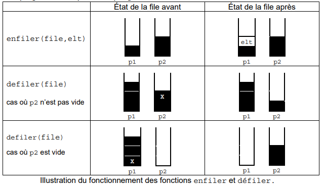

<table  style="background-color: #FFB7C5; width:100%;color:black;">
    <thead>
        <tr>
            <th style="text-align:center;border:solid;border-width:1px;font-size:20pt;width:70%;">Devoir : Listes - Piles et Files</th>
            <th style="text-align:center;border:solid;border-width:1px;font-size:12pt;width:30%">Thème 1 : Structures de donnée </th>
        </tr>
          <tr>
            <th style="text-align:center;border:solid;border-width:1px;font-size:15pt;width:70%;">EVALUATION</th>
            <th style="text-align:center;border:solid;border-width:1px;font-size:12pt;width:30%"></th>
        </tr>
    </thead>
</table>

## Exercice n°1 : 


On rappelle qu’une file est une structure de données abstraite fondée sur le principe « premier arrivé, premier sorti » :

{:.center}

On munit la structure de données File de quatre fonctions primitives définies dans le tableau ci-dessous :

!!! interface "Structure de données abstraite : Pile"
    Opérations :
    
    - `creer_file_vide` :  $\varnothing$ $\rightarrow$ File
        - `creer_file_vide()` renvoie une file vide
    - `est_vide` : File $\rightarrow$ Booléen
        - `est_vide(file)` renvoie True si file est vide, False sinon
    - `enfiler` : File, Élément $\rightarrow$ Rien
        - `enfiler(file, element)` ajoute element à la file
    - `defiler` : File $\rightarrow$ Élément
        - `defiler(file)` renvoie l’élément en tête de la file en le retirant de la file

!!! example "Question n°1 :"  
    On suppose dans cette question que le contenu de la file F est le suivant  

        < 9 , 4 , 2 , 5 , 8 <

    Quel serait le contenu de la file F1 aprés l'exécution de la suite d'instruction suivante ?

    ```python
    S=0
    F1=creer_file_vide()
    while not est_vide(F):
        S+=defiler(F)
        enfiler(F1,S)
    ```


!!! example "Question n°2 :"  
    On appelle hauteur d’une file le nombre d’éléments qu’elle contient. La fonction `hauteur_file` prend en paramètre une file F et renvoie sa hauteur. Après appel de cette fonction, la file F doit avoir retrouvé son état d’origine.
    
    **Exemple :** si F est la file de la question 1 : `hauteur_file(F)` = 5.
    
    Recopier et compléter sur votre copie le programme Python suivant implémentant la fonction `hauteur_file` en remplaçant les ??? par les bonnes instructions.

    ```python
    def hauteur_file(F):
    Q = creer_file_vide ()
    n = 0
    while not (est_vide (F)):
        ???
        x = defiler(P)
        ???
    while not (est_vide(Q)):
        ???
        enfiler(P,x)
    return ???
    ```

!!! example "Question n°3 :"  
    Créer une fonction `min_file` ayant pour paramètre une file F. Cette fonction renvoie la position j de l’élément minimum de la file F.
    
    Après appel de cette fonction, la file F devra avoir retrouvé son état d’origine. 

    **Exemple :** 
    si F est la file de la question 1 : `min_File(F)` = 2.

!!! example "Question n°4 :"  
    Créer une fonction `sup_element_file` ayant pour paramètres une file F et un élément e. Cette fonction supprime l'élément e de la file et renvoie la file F sans cet élément .
    
    **Exemple :** 
    si F est la file de la question 1 : `sup_element_File(F,4)` doit retourner :

    < 9 ,  2 , 5 , 8 <

!!! example "Question n°5 :"  
    On donne la foncton suivante qui renvoie la valeur du minimum de la file F.

    ```python
    def valeur_min_file(F):
        Q = creer_file_vide ()
        min=defiler(F)
        enfiler(Q,min)
        while not (est_vide (F)):
            x=defiler(F)
            if x <min:
                min=x
            enfiler(Q,x)
        while not (est_vide(Q)):
            x=defiler(Q)
            enfiler(F,x)
        return min
    ```

    Créer une fonction `sup_min_file` ayant pour paramètre une file F. Cette fonction supprime le minimum de la file et renvoie la file F sans cet élément.

    **Exemple :** 
    si F est la file de la question 1 : `sup_min_File(F)` doit retourner :
    
    < 9 , 4 , 5 , 8 <

!!! example "Question n°6 :"  
    On donne la fonction suivante : 

    ```python
    def mystere_file(F):
        Q = creer_file_vide ()
        while not (est_vide (F)):
            e=valeur_min_file(F)
            enfiler(Q,e)
            sup_min_file(F)
        while not (est_vide(Q)):
            x=defiler(Q)
            enfiler(F,x)
        return F
    ```
    Donner l'état de la file F de la question 1.
 


## Exercice n°2 : 

On choisit de stocker les données des processus en attente à l'aide d'une liste Python lst.  
    On dispose déjà d'une fonction `retirer(lst)` qui renvoie l'élément `lst[0]` puis le supprime de la liste `lst`.

!!! example "Question 1"  
    Écrire en Python le code d'une fonction `ajouter(lst, proc)` qui ajoute à la fin de la liste `lst` le nouveau processus en attente `proc`. 


On choisit maintenant d'implémenter une file `file` à l'aide d'un couple (`p1,p2)`où `p1` et `p2` sont des piles.  
Ainsi `file[0]` et `file[1]` sont respectivement les piles `p1` et `p2`.  
Pour enfiler un nouvel élément `elt` dans `file`, on l'empile dans `p1`.  
Pour défiler `file`, deux cas se présentent. 

- La pile `p2` n'est pas vide : on dépile `p2`.
- La pile `p2` est vide : on dépile les éléments de `p1` en les empilant dans `p2` jusqu'à ce que `p1` soit vide, puis on dépile `p2`.

{:.center}

On considère la situation représentée ci-dessous.  

{:.center}


!!! example "Question 2"
    On exécute la séquence d'instructions suivante :

    ```
    enfiler(file,ps6)
    defiler(file)
    defiler(file)
    defiler(file)
    enfiler(file,ps7)
    ```

    Représenter le contenu final des deux piles à la suite de ces instructions. 

!!! example "Question 3"
    On dispose des fonctions :

    - `empiler(p,elt)` qui empile l'élément `elt` dans la pile `p`,  
    - `depiler(p)` qui renvoie le sommet de la pile `p` si `p` n'est pas vide et le supprime,  
    - `pile_vide(p)` qui renvoie `True` si la pile `p` est vide, `False` si la pile `p` n'est pas vide.   

    a. Écrire en Python une fonction est_`vide(f)` qui prend en argument un couple de piles `f` et qui renvoie `True` si la file représentée par `f` est vide, `False` sinon. 

    b. Écrire en Python une fonction `enfiler(f,elt)` qui prend en arguments un couple de piles `f` et un élément `elt` et qui ajoute `elt` en queue de la file représentée par `f`. 

    c. Écrire en Python une fonction `defiler(f)` qui prend en argument un couple de piles `f` et qui renvoie l'élement en tête de la file représentée par `f` en le retirant. 

