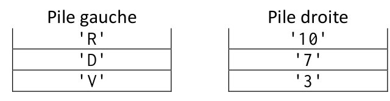
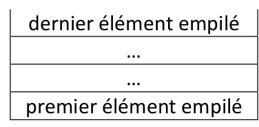

<table  style="background-color:  #F0F8FF; width:100%;color:black;">
    <thead>
        <tr>
            <th style="text-align:center;border:solid;border-width:1px;font-size:20pt;width:70%;">Devoir n°5 : Les Piles et les Files</th>
            <th style="text-align:center;border:solid;border-width:1px;font-size:12pt;width:30%">Thème 1 : Structures de données</th>
        </tr>
          <tr>
            <th style="text-align:center;border:solid;border-width:1px;font-size:15pt;width:70%;"></th>
            <th style="text-align:center;border:solid;border-width:1px;font-size:12pt;width:30%">EVALUATION</th>
        </tr>
    </thead>
</table>


| |Exercice n°1 | Exercice n°2| 
|:---:|:---:|:---:|
|Barème | 8 pts | 8 pts |


<blockquote style="background-color: #5D8AA8; border-left: 7px solid rgb(0 0 0);"> 
   <span style="font-size:30px; color:white;"> Exercice n°1 : Sujet BAC 2021</span>
</blockquote>

_Cet exercice traite des notions de piles et de programmation orientée objet._  


On crée une classe Pile qui modélise la structure d'une pile d'entiers.  

Le constructeur de la classe initialise une pile vide.  

La définition de cette classe sans l’implémentation de ses méthodes est donnée ci-dessous.

```python
class Pile:
    def __init__(self):
        """Initialise la pile comme une pile vide."""
        
    def est_vide(self):
        """Renvoie True si la liste est vide, False sinon."""
        
    def empiler(self, e):
        """Ajoute l'élément e sur le sommet de la pile, ne renvoie rien."""
        
    def depiler(self):
        """Retire l’élément au sommet de la pile et le renvoie."""
        
    def nb_elements(self):
        """Renvoie le nombre d'éléments de la pile. """
        
    def afficher(self):
        """Affiche de gauche à droite les éléments de la pile, du fond
        de la pile vers son sommet. Le sommet est alors l’élément
        affiché le plus à droite. Les éléments sont séparés par une
        virgule. Si la pile est vide la méthode affiche « pile
        vide »."""
        
```        

Seules les méthodes de la classe ci-dessus doivent être utilisées pour manipuler les objets
Pile. 

!!! example "1.a"
    Écrire une suite d’instructions permettant de créer une instance de la classe Pile affectée à une variable `pile1` contenant les éléments 7, 5 et 2 insérés dans cet ordre.  
    Ainsi, à l’issue de ces instructions, l’instruction `pile1.afficher()` produit l’affichage : 7, 5, 2. 

!!! example "1.b"
    Donner l’affichage produit après l’exécution des instructions suivantes.
    ```
    element1 = pile1.depiler()
    pile1.empiler(5)
    pile1.empiler(element1)
    pile1.afficher()
    ```


!!! example "2."
    On donne la fonction mystere suivante :  

    ```python
    def mystere(pile, element):
        pile2 = Pile()
        nb_elements = pile.nb_elements()
        for i in range(nb_elements):
            elem = pile.depiler()
            pile2.empiler(elem)
            if elem == element:
                return pile2
        return pile2 
    ```

    a. Dans chacun des quatre cas suivants, quel est l’affichage obtenu dans la console ?  

    - Cas n°1  
    ```python
    >>>pile.afficher()
    7, 5, 2, 3
    >>>mystere(pile, 2).afficher()
    ```
    - Cas n°2  
    ```python
    >>>pile.afficher()
    7, 5, 2, 3
    >>>mystere(pile, 9).afficher()
    ```

    - Cas n°3  
    ```python
    >>>pile.afficher()
    7, 5, 2, 3
    >>>mystere(pile, 3).afficher()
    ```

    - Cas n°4 
    ```python
    >>>pile.est_vide()
    True
    >>>mystere(pile, 3).afficher() 
    ```


    b. Expliquer ce que permet d’obtenir la fonction `mystere`.


!!! example "3."
    Écrire une fonction `etendre(pile1, pile2)` qui prend en arguments deux objets Pile appelés pile1 et pile2 et qui modifie pile1 en lui ajoutant les éléments de pile2 rangés dans l'ordre inverse. Cette fonction ne renvoie rien.  
    On donne ci-dessous les résultats attendus pour certaines instructions.

    ```python
    >>>pile1.afficher()
    7, 5, 2, 3
    >>>pile2.afficher()
    1, 3, 4
    >>>etendre(pile1, pile2)
    >>>pile1.afficher()
    7, 5, 2, 3, 4, 3, 1
    >>>pile2.est_vide()
    True 
    ```

!!! example "4."
    Écrire une fonction supprime_toutes_occurences(pile, element) qui prend en arguments un objet Pile appelé pile et un élément element et supprime tous les éléments element de pile.  
    On donne ci-dessous les résultats attendus pour certaines instructions.  

    ```python
    >>>pile.afficher()
    7, 5, 2, 3, 5
    >>>supprime_toutes_occurences (pile, 5)
    >>>pile.afficher()
    7, 2, 3

    ```


<blockquote style="background-color: #5D8AA8; border-left: 7px solid rgb(0 0 0);"> 
   <span style="font-size:30px; color:white;"> Exercice n°2 : Sujet BAC 2021</span>
</blockquote>

On cherche à obtenir un mélange d'une liste comportant un nombre pair d'éléments.  
Dans cet exercice, on notera N le nombre d'éléments de la liste à mélanger.  

La méthode de mélange utilisée dans cette partie est inspirée d’un mélange de jeux de cartes :
- On sépare la liste en deux piles :
    - à gauche, la première pile contient les N/2 premiers éléments de la liste ;
    - à droite, la deuxième pile contient les N/2 derniers éléments de la liste.
- On crée une liste vide.
- On prend alors le sommet de la pile de gauche et on le met en début de liste.
- On prend ensuite le sommet de la pile de droite que l’on ajoute à la liste et ainsi de suite jusqu’à ce que les piles soient vides. 

Par exemple, si on applique cette méthode de mélange à la liste `['V','D','R','3','7','10']`, on obtient pour le partage de la liste en 2 piles :

{:.center width=60%}

La nouvelle liste à la fin du mélange sera donc `['R','10','D','7','V','3']`

!!! example "Question 1"
    Que devient la liste `['7','8','9','10','V','D','R','A']` si on lui applique cette méthode de mélange ?


On considère que l’on dispose de la structure de données de type pile, munie des seules instructions suivantes :   

```
p = Pile() : crée une pile vide nommée p
p.est_vide() : renvoie Vrai si la liste est vide, Faux sinon
p.empiler(e) : ajoute l’élément e dans la pile
e = p.depiler() : retire le dernier élément ajouté dans la pile et le retourne (et l’affecte à la variable e)
p2 = p.copier() : renvoie une copie de la pile p sans modifier la pile p et l’affecte à une nouvelle pile p2
```

!!! example "Question 2" 
    Recopier et compléter le code de la fonction suivante qui transforme une liste en pile.
    ```python
    def liste_vers_pile(L):
        '''prend en paramètre une liste et renvoie une pile'''
        N = len(L)
        p_temp = Pile()
        for i in range(N):
            ...
        return ...
    ```

!!! example "Question 3"
    On considère la fonction suivante qui partage une liste en deux piles. Lors de sa mise au point et pour aider au débuggage, des appels à la fonction affichage_pile ont été insérés. La fonction affichage_pile(p) affiche la pile p à l’écran verticalement sous la forme suivante :

    {:.center width=35%}

    ```python
    def partage(L):
        N = len(L)
        p_gauche = Pile()
        p_droite = Pile()
        for i in range(N/2):
            p_gauche.empile(L[i])
        for i in range(N/2,N):
            p_droite.empile(L[i])
        affichage_pile(p_gauche)
        affichage_pile(p_droite)
        return p_gauche, p_droite
    ```

    Quels affichages obtient-on à l’écran lors de l’exécution de l’instruction : 
    ```python
    partage([1,2,3,4,5,6])
    ```
    ?

!!! example "Question 4"
    4.a Dans un cas général et en vous appuyant sur une séquence de schémas, expliquer en quelques lignes comment fusionner deux piles p_gauche et p_droite pour former une liste L en alternant un à un les éléments de la pile p_gauche et de la pile p_droite.  
    4.b. Écrire une fonction fusion(p1,p2) qui renvoie une liste construite à partir des deux piles p1 et p2.

!!! example "Question 5"
    Compléter la dernière ligne du code de la fonction affichage_pile pour qu’elle fonctionne de manière récursive.

    ```python
    def affichage_pile(p):
        p_temp = p.copier()
        if p_temp.est_vide():
            print('____')
        else:
            elt = p_temp.depiler()
            print('| ', elt, ' |'))
            ...             # ligne à compléter
    ```