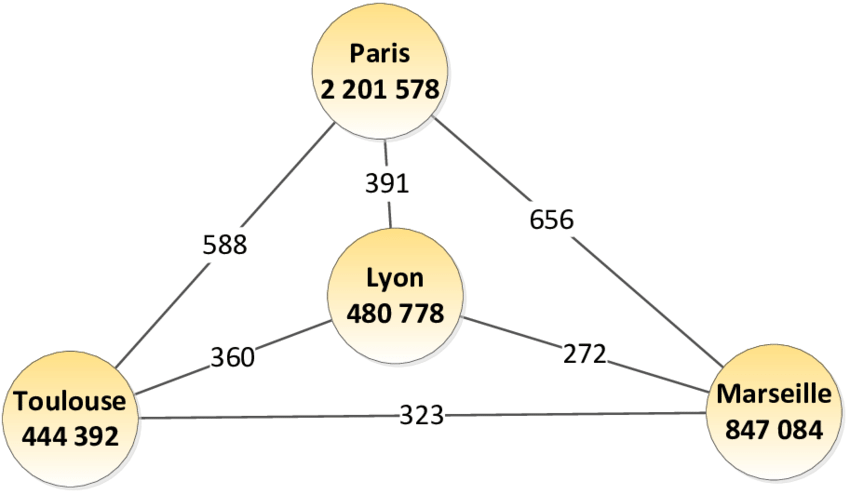
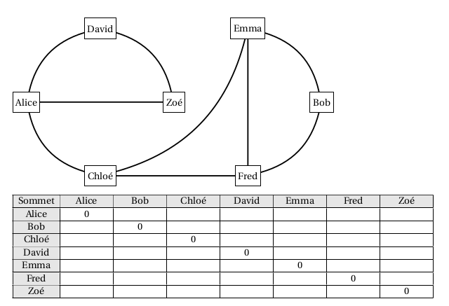
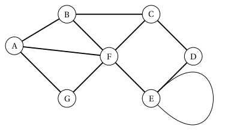
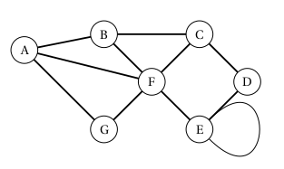

<table  class="greenTable">
        <tr>
            <th>
            Thème  : Structure de données
            </th>
        </tr>
</table>
<br>
<table  class="greenTable">
        <tr >
            <th width="20%"; style="background-color: #3B444B;color:white;text-align:center;border:none;font-size:40pt;">
            23
            </th>
            <th  width="80%"; style="text-align:center;border:none;font-size:25pt;">Les Graphes</th>
        </tr>
</table>
<br>


Le programme de N.S.I en Terminale :

|Contenus|Capacités attendues|Commentaires|
|:---:|:---|:---:|
|Graphes - structures relationnelles. | Modéliser des situations sous forme de graphes | On s'appuie sur des exemples comme le réseau routier, le réseau électrique, Internet, les réseaux sociaux.|
|Sommets, arcs, arêtes, graphes orientés ou non orientés. | Écrire les implémentations correspondantes d'un graphe : matrice d'adjacence, liste de successeurs/de prédécesseurs. | Le choix de la représentation dépend du traitement qu'on veut mettre en place :|
| Passer d'une représentation à une autre. | on fait le lien avec la rubrique « algorithmique »|


Initiée par le grand mathématicien suisse **Euler**, avec le célèbre
problème des 7 ponts de Königsberg, les applications de la théorie des
graphes et de la recherche opérationnelle sont aujourd'hui immenses tant
au plan civil que militaire :

- aide à la prise de décision ;  
- recherche de la meilleure stratégie ;
- optimisation (plus court chemin, GPS, coût minimal, ordonnancement des  tâches ...) ;  
- réseaux de transports (autoroutes, chemins de fer, métro, lignes aériennes ...) ;  
- transport de l'énergie (électricité, gaz \...) ;  
- transport de l'informations : internet, réseaux sociaux ...  

La théorie des graphes n'est pas une branche indépendante des mathématiques, elle se rattache à la programmation linéaire, la programmation convexe (où le concept plus général de fonction convexe remplace les fonctions linéaires et affines), le calcul des probabilités.  
Les graphes sont une **_structure de données_** très riche permettant de **_modéliser des situations variées de relations_** entre un ensemble d'entités :

- entre les ordinateurs du réseau internet ;  
{:.center width=350px}  
-  entre des personnes sur un réseau social ;  
{:.center width=350px}  
-  entre les villes dans un réseau routier ou de distribution ;  
{:.center width=350px}   
- entre les atomes d'une molécule ;  
{:.center width=350px}   
-  etc  

## Un peu de vocabulaire sur les graphes


!!! voc "Ce qu'il faut retenir"
    D’un point de vue mathématique, un graphe est la donnée
    
    - d’un certain nombre de points du plan, appelés **_sommets_** ,  
    - certains étant reliés par des segments de droites ou de courbes     (simples) appelés **_arêtes_** ,  
    - la disposition des sommets et la forme choisie pour les arêtes n’intervenant pas.  
    - Le nombre de sommets du graphe est son **_ordre_**.  

Sauf indication contraire, un graphe sera considéré comme non orienté et
les arêtes pourront être parcourues dans les deux sens.  

### Vocabulaire des graphes non orientés

!!! voc "Ce qu'il faut retenir"
    Dans le cas des graphes non orientés, les relations entre deux sommets se font dans les deux sens.
    On appelle ses relations des arêtes (edges en anglais), et on a les définitions suivantes :  

    - **_Sommets adjacents_** : deux sommets sont adjacents s’ils sont reliés entre eux par une arête.  
    On dit que l’arête est incidente aux deux sommets.  
    - **_Voisins d’un sommet x_** : ce sont tous les sommets reliés à x par une arête.  
    - **_Degré d’un sommet x_** : nombre d’arêtes incidentes au sommet, on le note d (x).  
    - **_Chaîne_** : séquence ordonnée d’arêtes telle que chaque arête a une extrémité en commun avec l’arête suivante.  
    - **_Cycle_** : dans un graphe non orienté, un cycle est une suite d’arêtes consécutives (chaîne) dont les deux sommets extrémités sont identiques.  
    - **_Boucle_** : il peut exister des arêtes entre un sommet x et lui-même. Elles sont appelés boucles.  

{:.center width=450px}

!!! exo "Exercice 1 "
    - Citer des sommets adjacents.  
    - Donner le degré de chacun des sommets.  
    - Citer une chaîne.  
    - Donner un cycle.  
    - Y-t-il une boucle ?

### Vocabulaire des graphes orientés

!!! voc "Ce qu'il faut retenir"
    Dans le cas des graphes orientés, les arêtes ont un sens et elles sont appelées arcs. Par exemple,  
    l’arête a = (x, y) indique qu’il y a un arc d’origine x et d’extrémité finale y. De plus, on a les définitions suivantes.  
    
    - **_Successeurs et prédécesseurs d’un sommet x_** : dans un graphe orienté on ne parle plus de voisins d’un sommet mais de ses successeurs et de ses prédécesseurs : le successeurs de x sont tous les sommets y tels qu’il existe un arc (x, y) (de x vers y) et les prédécesseurs de x sont tous les sommets w tels qu’il existe un arc (w, x) (de w vers x).  
    -  **_Chemin_** : séquence ordonnée d’arcs consécutifs (on parlait de chaîne dans un graphe non orienté).  
    - **_Circuit_** : dans un graphe orienté, un circuit est une suite d’arcs consécutifs (chemin) dont les deux sommets extrémités sont identiques.  
    - **_Degré d’un sommet x_** : cette notion existe aussi dans le cas des graphes orientés. On distingue le degré entrant d’un sommet x (noté $d_-(x)$= nombre de prédécesseurs de x) et le degré sortant d’un sommet x (noté $d_+(x)$= nombre de successeurs de x ). Le degré d’un sommet x vaut $d (x) = d_+(x) + d_-(x)$.
    • **_Boucle_** : ce sont les arcs entre un sommet et lui-même.

{:.center width=350px}


!!! exo "Exercice 2"
    - Citer le(s) successeurs de A et le(s) prédécesseur(s) de A.  
    - Donner le degré de chacun des sommets.  
    - $A,B,F$ est-il un chemin.  
    - Donner un circuit.  
    - Y-t-il une boucle ?


### Graphes valués ou pondérées

!!! voc "Ce qu'il faut retenir"
    Certains graphes (orientés ou non) sont dits valués : on ajoute un coût (ou valuation, ou poids) à chaque arête/arc. Dans le cas d'un graphe représentant un réseau routier, le coût sur chaque arête pourrait, par exemple, être la distance entre deux villes.


## Réseaux sociaux : modélisation par un graphe 

Au premier trimestre 2020, Facebook© revendiquait 2,6 milliards
d'utilisateurs actifs chaque mois, en hausse de 9,2% par rapport à début
2019. Le réseau social américain a passé la barre symbolique des 2
milliards au deuxième trimestre 2017. A noter que 42% des utilisateurs
actifs mensuels de Facebook viennent d'Asie-Pacifique, 15,6% sont
Européens et 9,7% sont Nord-américains. Facebook permet à ses
utilisateurs d'entrer des informations personnelles et d'interagir avec
d'autres utilisateurs. Les interactions entre utilisateurs reposent sur
la notion « d'amis ».

### Principe de la modélisation par un graphe non orienté


Imaginez un réseau social ayant 7 abonnés (L, M, N, O, P, Q et R) où :

-  L est ami avec M, N, O et P ;

-  M est ami avec L et P ;

-  N est ami avec L, O et P ;

-  O est ami avec L,N,P,Q et R ;

-  P est ami avec O,L et M ;

-  Q est ami avec N et O ;

-  R est ami avec O.

La description de ce réseau social, malgré son faible nombre d'abonnés,
est déjà quelque peu compliquée, alors imaginez cette même description
avec un réseau social comportant des millions d'entre eux !  
Il existe un moyen plus "visuel" pour représenter ce réseau social :  
on peut représenter chaque abonné par un cercle (avec le nom de l'abonné
situé dans le cercle) et chaque relation "X est ami avec Y" par un
segment de droite reliant X et Y ("X est ami avec Y" et "Y est ami
avec X" étant représenté par le même segment de droite). Le mini-réseau
social décrit précédemment peut être modélisé sous la forme du graphe
ci-dessous :


!!! voc "Un peu de vocabulaire sur les graphes des réseaux sociaux..."
    - La **_distance_** entre deux sommets d’un graphe est le nombre minimum d’arêtes pour aller du sommet à un autre.  
    Exemple : entre L et R la distance est 2.  
    - L’**_écartement_** d’un sommet est la distance maximale existant entre ce sommet et les autres sommets du graphe.  
    Exemple : pour le sommet Q, la plus grande distance avec un autre sommet est 3 ; l’écartement est donc de 3.  
    - Le **_centre_** d’un graphe est le sommet d’écartement minimal (le centre n’est pas nécessairement unique).  
    Exemple : les sommets Q et R ont un écartement de 3, les autres un écartement de 2 ; les centres sont donc L, N, O, P.  
    - Le **_rayon_** d’un graphe est l’écartement d’un centre du graphe.  
    Exemple : les centres L, N, O, P ont un écartement de 2 ; le rayon du graphe est donc 2.  
    - Le **_diamètre_** d’un graphe est la distance maximale entre deux sommets du graphe.  
    Exemple : l’écartement max étant 3 (entre Q et M ou entre R et M), le diamètre du graphe est 3.


!!! exo "Exercice 3"
    - Construisez un graphe de réseau social à partir des informations suivantes :

    - A est ami avec B, D et E ;  
    - B est ami avec A, C et D ;  
    - C est ami avec B et D ;  
    - D est ami avec A, B, C et E ;  
    - E est ami avec A et F ;  
    - F est ami avec E.

    - Compléter le tableau ci-dessous des distances entre sommets :   
        

    - Quel est le centre du graphe  
    - Quel est le rayon du graphe ?  
    - Quel est le diamètre du graphe ?


### Implémentation d'un graphe non orienté à l'aide d'une matrice d'adjacence


Un **graphe non orienté** peut être transcrit sous la forme d'une
matrice d'adjacence qui sera simple à coder dans un programme Python.

!!! voc "Matrice d'adjacence"
    Une matrice M est un tableau de nombres, qui peut être représenté en machine par un tableau de tableaux (ou une liste de listes) noté matrice. Chaque nombre de cette matrice est repéré par son numéro de ligne $i$ et son numéro de colonne $j$.  
    On note ce nombre $M_{i,j}$ et on peut y accéder par l'instruction `matrice[i][j]`.  
    Un graphe à $n$ sommets peut être représentée par une matrice d'adjacence de taille $n \times n$, où la valeur du coefficient d'indice $i,j$ dépend de l'existence d'une arête ou d'un arc reliant les sommets $i$ et $j$.


**Comment construire une matrice d'adjacence ?**

Il faut savoir qu'à chaque ligne correspond un sommet du graphe et qu'à
chaque colonne correspond aussi un sommet du graphe. À chaque
intersection ligne $i$-colonne $j$ (ligne $i$ correspond au sommet $i$
et colonne $j$ correspond au sommet $j$), on place un 1 s'il existe une
arête entre le sommet $i$ et le sommet $j$, et un zéro s'il n'existe pas
d'arête entre le sommet $i$ et le sommet $j$.

En d'autre terme, pour construire la matrice d'adjacence associée à un
graphe, il suffit, pour chaque intersection ligne / colonne, de répondre
à la question :  
Est-ce que le sommet « X » est relié directement au sommet « Y » par une
arête ?  
Si la réponse est OUI → 1  
Si la réponse est NON → 0  

**Graphe non orienté est ami avec**


En Python on code une matrice d'adjacence sous la forme d'une liste de listes. Chaque sous-liste représente une colonne de la matrice d'adjacence.

``` {.python bgcolor="lightgray!30" frame="lines"}
#Matrice d'adjacence :
m = [[0, 1, 1, 1, 0, 0],
     [1, 0, 0, 1, 0, 0],
     [1, 0, 0, 1, 1, 0],
     [1, 1, 1, 0, 1, 1],
     [0, 0, 1, 1, 0, 1],
     [0, 0, 0, 1, 1, 0],
]
```

!!! ugli-note "Remarque"
    - Une matrice d’adjacence est qualifiée de matrice carrée car elle comporte toujours le même nombre de lignes et de colonnes.
    - Dans le cadre d’un graphe non orienté de type « est ami avec », les éléments de la matrice d’adjacence associée sont symétrique par rapport à la grande diagonale des 0.


!!! exo "Exercice 4"
    - Compléter la matrice d'adjacence et écrire son codage Python correspondant au graphe non orienté suivant traduisant la relation « est ami avec »

    

    - Écrire un programme Python permettant de calculer le nombre d'amis de chaque utilisateur du réseau « d'amitiés » précédent à partir de la matrice d'adjacence.

### Implémentation d'un graphe orienté à l'aide d'une matrice d'adjacence


Dans le modèle du mini-réseau social précédent, le graphe est non
orienté : il traduit seulement le fait qu'un utilisateur est ami avec un
autre (relation bijective). La notion de « followers » que l'on
rencontre dans de nombreux réseaux sociaux (Twitter en est un exemple),
nécessite quant à elle d'orienter les arêtes du graphe (elles deviennent
alors des arcs) afin de traduire la relation « X » suit « Y ».  
Ainsi dans l'exemple de graphe orienté ci-dessous, Alice (origine) suit
Zoé et Chloé (extrémités).

**Graphe orienté est ami avec**


!!! exo "Exercice 5"
    - Comment peut-on obtenir facilement le nombre de personnes suivies par une personne donnée ? Écrire la fonction Python correspondante.  
    - Comment peut-on obtenir facilement le nombre de personnes qui suivent une personne donnée ? Écrire la fonction Python correspondante.  
    - Compléter le programme Python afin qu'il affiche, pour une personne donnée, le nombre de personnes qu'elle suit et le nombre de personnes qui la suivent?

## Représentation par matrice d'adjacence -- Exercice


On considère le graphe non orienté suivant :



!!! fabquestion "Question"
    Écrire la matrice d'adjacence
    
!!! voc "Ce qu'il faut retenir"
    Dans le cas d'un graphe non orienté, la matrice d'adjacence est nécessairement symétrique par rapport à sa diagonale :  
    on a $M_{i,j}=M_{j,i}$.gr

On considère le graphe orienté suivant :


!!! fabquestion "Question"
    Écrire la matrice d'adjacence

!!! voc "Ce qu'il faut retenir"
    Comme les arcs ont un sens, la matrice d'adjacence d'un graphe orienté n'est généralement pas symétrique.


## Représentation par listes des successeurs


Une autre façon de représenter un graphe est d'associer à chaque sommet
la liste des sommets auxquels il est relié. Dans le cas d'un graphe
orienté, on parle de liste de successeurs, alors que dans le cas d'un
graphe non orienté on parle de liste de voisins.

Une façon simple et efficace est d'utiliser un dictionnaire où chaque
sommet est associé à la liste de ses successeurs/voisins.

**Exemple : Graphe non orienté**



Ce graphe peut être représenté par le dictionnaire suivant, où les clés
sont les sommets et les valeurs sont les listes de voisins.

``` {.python frame="lines" bgcolor="lightgray!30"}
graphe1 = {
 "A": ["B", "F", "G"],
 "B": ["A", "C", "F"],
 "C": ["B", "D", "F"],
 "D": ["C", "E"],
 "E": ["D", "E", "F"],
 "F": ["A", "B", "C", "E", "G"],
 "G": ["A", "F"]
}
```

**Exemple : Graphe orienté**


!!! fabquestion "Question"
    Complétez le programme suivant :

    ``` {.python frame="lines" bgcolor="lightgray!30"}
    graphe2 = {
        "A": ...
        "B": ...
        "C": ...
        "D": ...
        "E": ...
        "F": ...
        "G": ...
        }
    ```


**Un autre exemple**


Le code suivant permet d'implémenter un graphe en langage Python

``` {.python frame="lines" bgcolor="lightgray!30"}
graphe = dict()    # création d'un dictionnaire vide 
graphe["A"] = ["B","C","E","F","H"] # liens de A vers les sommets listés
graphe["B"] = ["A","D","H"]
graphe["C"] = ["A","F", "G","H"]
graphe["D"] = ["B","H"]
graphe["E"] = ["A","H"]
graphe["F"] = ["A","C"]
graphe["G"] = ["C","H"]
graphe["H"] = ["A","B","C","D","E","G"]
```

!!! ugli-note "Rappel"
    Vous avez vu l’an dernier dans le cours sur les dictionnaires, qu’il est possible :  
    
    - d’obtenir l’ensemble des clés avec la méthode keys() en sachant que graphe.keys() est un itérable,  
    - d’obtenir l’ensemble des clés avec la méthode values() en sachant que graphe.values() est un itérable.  


!!! fabquestion "Question"
    En s'aidant de la remarque précédente, proposer une fonction ordre en langage Python qui reçoit en paramètre un dictionnaire et renvoie l'ordre de ce graphe. 

!!! fabquestion "Question"
    Tester votre fonction ordre en utilisant le graphe de l'exemple introductif, implémenté en langage Python ci-dessus.

!!! fabquestion "Question"
    Écrire une fonction `sommets_adjacents` qui prend en paramètre un dictionnaire ainsi qu'un sommet sous forme de chaîne de caractères et qui renvoie la liste des sommets adjacents à ce sommet entré comme paramètre.

!!! fabquestion "Question"
    Tester la fonction sommets\_adjacents sur le sommet A.

!!! fabquestion "Question"
    Proposer des préconditions.

!!! fabquestion "Question"
    Proposer une fonction `lister_aretes` qui prend en paramètre un dictionnaire et renvoie la liste des arêtes d'un graphe. Une arête sera représentée par un tuple à deux éléments. ( Attention aux doublons)

!!! fabquestion "Question"
    Écrire une fonction degre qui prend en paramètre un dictionnaire ainsi qu'un sommet sous forme de chaîne de caractères et qui renvoie le degré de ce sommet entré comme paramètre.

!!! fabquestion "Question"
    Tester la fonction degre.

!!! fabquestion "Question"
    Proposer des préconditions.

!!! fabquestion "Question"
    Proposer une fonction nombre\_aretes qui prend en paramètre un dictionnaire et renvoie le nombre d'arêtes d'un graphe.

## Efficacité des représentations


La matrice d'adjacence est simple à mettre en œuvre mais nécessite un
espace mémoire proportionnel à $n \times n$ (où $n$ est le nombre de
sommets). Ainsi, un graphe de 1000 sommets nécessitent une matrice d'un
million de nombres même si le graphe contient peu d'arêtes/arcs. Pour le
même graphe contenant peu d'arêtes/arcs, le dictionnaire ne mémoriserait
pour chaque sommet que les voisins/successeurs (les 1) sans avoir à
mémoriser les autres (les 0). En revanche, pour un graphe contenant
beaucoup d'arêtes/arcs, la dictionnaire occuperait plus d'espace mémoire
que la matrice d'adjacence.

Cela implique en outre que l'accès aux voisins/successeurs d'un sommet
est plus rapide avec le dictionnaire car il n'est pas nécessaire de
parcourir toute la ligne de la matrice ($n$ valeurs) alors même que
celle-ci peut ne contenir que très peu de 1.

De plus, l'utilisation d'un dictionnaire permet de nommer les sommets
sans ambiguïté et ne les limite pas à des entiers comme c'est le cas
pour la matrice d'adjacence (même si on peut associer chacun de ces
entiers au sommet correspondant, ce que nous avons fait précédemment).

Enfin, au lieu d'utiliser le type liste (list de Python ici) pour
mémoriser les voisins/successeurs, on peut avantageusement utiliser le
type ensemble (type prédéfini set de Python) qui est une structure de
données permettant un accès plus efficace aux éléments (l'implémentation
se fait par des tables de hachage, hors programme de NSI).
