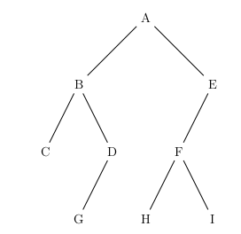

<table  style="background-color: #FFB7C5; width:100%;color:black;">
    <thead>
        <tr>
            <th style="text-align:center;border:solid;border-width:1px;font-size:20pt;width:70%;">TD n°15 : Structures de données - Les Arbres</th>
            <th style="text-align:center;border:solid;border-width:1px;font-size:12pt;width:30%">Thème 1 : Structures de donnée </th>
            <th style="text-align:center;border:solid;border-width:1px;font-size:12pt;width:30%">Thème 4 : Algorithmique</th>
        </tr>
          <tr>
            <th style="text-align:center;border:solid;border-width:1px;font-size:15pt;width:70%;">COURS et EXERCICES</th>
            <th style="text-align:center;border:solid;border-width:1px;font-size:12pt;width:30%"></th>
        </tr>
    </thead>
</table>

{:.center}

!!! progrNSI "&#x1F4D8; Le Programme en N.S.I en Terminale"
        
    - Définition d’un arbre binaire
    - Mesure des arbres binaires,
    - Représentation en Python,
    - d’appréhender la complexité de la manipulation des listes,
    - Algorithme des binaires.

    | Contenus | Capacités attendues| Commentaires|
    |:---|:---|:---|
    |Arbres : structures hiérarchiques.|Identifier des situations nécessitant une structure de données arborescente..|On fait le lien avec la rubrique « algorithmique ».|
    |Arbres binaires : nœuds, racines, feuilles, sous-arbres gauches, sous-arbres droits.| Évaluer quelques mesures des arbres binaires (taille,encadrement de la hauteur, etc.).||
    ||||
            


La notion de liste chaînée explorée dans les TP précédents est parfaite pour structurer un ensemble
d’éléments destiné à être énuméré séquentiellement.  

Comme on l’a vu avec la réalisation de piles et de files, cette structure permet également un accès simple au début de la séquence et éventuellement à certaines autres positons choisies.  

Elle n’est pas en revanche pas adaptée aux accès ponctuels à des positions arbitraires dans la séquence, puisqu’il faut pour cela à chaque nouvel accès parcourir tous les maillons depuis la tête de liste jusqu’à la position cherchée, ce qui prend en moyenne un temps proportionnel au nombre d’éléments stockés dans la structure.

<blockquote style="background-color: #536872; border-left: 7px solid rgb(0 0 0);"> 
    <span style="font-size:30px; color:white;"> I. Structures arborescentes </span></blockquote>
    
Les **structures arborescentes** forment une autre famille de structures chainées, dans lesquelles le nombre de sauts à effectuer pour aller depuis le point de départ jusqu’à une position souhaitée est potentiellement bien moindre.  
Ces structures sont omniprésentes en informatique, par exemple l’arborescence des fichiers d’un ordinateur. Cette représentation des fichiers permet notamment, partant d’un répertoire racine et voyageant de répertoire en sous-répertoire, d’accéder en un petit nombre d’étapes à n’importe quel fichier choisi parmi des dizaines de milliers, pour peu qu’on aille dans la bonne direction.    

{:.center}

Ce principe d’un point de départ unique à partir duquel une structure chainée se scinde à chaque étape en plusieurs branches donne une idée générale de la structure d’arbre en informatique, qui est à la base d’innombrables structures de données. Cette structure permet en outre une organisation hiérarchique de l’information, ce qui la rend utile pour représenter des des programmes, des formules logique, le contenu de pages web,etc...  

Dans ce chapitre, nous allons nous concentrer sur les arbres binaires , une forme particulière mais trés répandue de structure arborescente.

<blockquote style="background-color: #536872; border-left: 7px solid rgb(0 0 0);"> 
    <span style="font-size:30px; color:white;"> II. Arbres quelconques </span></blockquote>

!!! abstract "Vocabulaire"    
    Dans la terminologie informatique, on utilise les termes de 

    - **feuille** pour les informations élémentaires, 
    - **noeud** pour chaque embranchement de l'arbre,
    - **racine** pour le(s) noeud(s) principal(aux).

> **Attention** : l'analogie avec les arbres réels peut s'avérer trompeuse. Les arbres - en informatique - sont le plus souvent représentés avec la racine en haut, puis les noeuds, et les feuilles en bas.

Il s'agit d'une structure de données absraite permettant de représenter une collection de données par des noeuds organisés de manière hiérarchique : il y a un (parfois plusieurs) noeud racine et chaque noeud dépend d'un *antécédent* (sauf la racine) et a des *descendants* (sauf les feuilles).

!!! abstract "Vocabulaire"  
    Dans le vocabulaire des arbres on utilise les termes *père* et *fils* pour désigner respectivement un antécédent et les descendants.

    - **Père** : chaque noeud possède exactement un seul noeud *père*, celui dont il est issu, à l'exception de la racine qui n'en a pas.
    - **Fils** : chaque noeud peut avoir un nombre arbitraire de noeuds *fils*, dont il est le père.

    Ainsi, avec ces définitions :

    - les **feuilles** sont les noeuds qui n'ont pas de fils,
    - un noeud qui n'a pas de père s'appelle une **racine**.

Tous les noeuds qui ne sont pas des feuilles sont appelés des **noeuds internes** (et les feuilles parfois appelées des *noeuds externes*).

L'intérêt des arbres est d'y stocker de l'information. Pour cela, chaque noeud peut contenir une ou plusieurs valeurs. L'information portée par un noeud s'appelle l'**étiquette** du noeud (ou la *valeur*, ou la *clé*).

{:.center}

**Exemple :**  
{:.center}

Dans cet arbre :

- La racine est le noeud A.
- Le noeud B possède 3 fils (les noeuds D, E et F), le noeud C possède un fils (le noeud G), le noeud F ne possède aucun fils.
- Le noeud B a pour père le noeud A.
- Les feuilles sont les noeuds D, H, I, F et G (ceux qui n'ont pas de fils).

## Caractéristiques d'un arbre

!!! abstract "Définition"

    - La **taille** d'un arbre est le nombre de noeuds qu'il possède.
    - La **profondeur** d'un noeud est la longueur du chemin le plus court entre ce noeud et la racine (la racine a donc une profondeur égale à 0).
    - La **hauteur** d'un arbre est la profondeur maximale de ses noeuds (elle vaut 0 pour l'arbre réduit à sa racine et $-1$ par convention pour un arbre vide).

> **Attention** : On trouve aussi dans la littérature, que la profondeur de la racine est égale à 1, ce qui modifie la hauteur de l'arbre également puisqu'alors l'arbre réduit à la racine a pour hauteur 1 et l'arbre vide a pour hauteur 0. Les deux définitions se valent, il faut donc bien lire celle qui est donnée.


**Exemple :**  

{:.center}

- La **taille** de l'arbre est égale à 9 (il possède 9 noeuds : 4 noeuds internes et 5 feuilles).
- Le noeud E a une **profondeur** égale à 2 (le chemin A-B-E a une longueur égale à 2).
- La **hauteur** de l'arbre est égale à 3 (la prodondeur maximale est égale à 3, c'est celle des noeuds les plus profonds : H et I).

*Dans la suite, on ne s'intéressera qu'aux arbres dont les noeuds ont au plus deux fils.*

<blockquote style="background-color: #536872; border-left: 7px solid rgb(0 0 0);"> 
    <span style="font-size:30px; color:white;"> II. Définition et propriétés des arbres binaires </span></blockquote>
    
    
> Seuls les **arbres binaires** sont au programme de Terminale NSI.

## Définition et vocabulaire spécifique  


!!! abstract "Arbre binaire"
    Un <strong>arbre binaire</strong> est un arbre dont tous les noeuds ont au plus deux fils.
    


L'arbre vu dans le paragraphe précédent n'est pas binaire car le noeud B possède 3 fils. 
En revanche, l'arbre suivant est binaire.

{:.center}

Les définitions vues précédemment pour des arbres quelconques restent bien évidemment valables pour les arbres binaires. Dans le cas d'un arbre binaire, chaque noeud possède deux sous-arbres, éventuellement vides, que l'on appelle **sous-arbre gauche** et **sous-arbre droit**.

Par exemple, dans le cas de l'arbre binaire précédent, le noeud A possède un sous-arbre gauche et un sous-arbre droit comme la figure suivante le montre.

{:.center}

Les sous-arbres gauche et droit de A sont eux-mêmes des arbres dont les racines sont respectivement B et C. Ces noeuds possèdent eux-même des sous-arbres gauche et droit. Par exemple, le noeud C possède un sous-arbre gauche, qui est vide, et un sous-arbre droit qui est l'arbre dont la racine est G. Ainsi de suite...

!!! example "Exercice n°1  : Vocabulaire"

    Voici un arbre :

    {:.center}

    1. Quelle est la taille de cet arbre ?
    2. Listez les noeuds internes puis les feuilles.
    3. Quelle est la hauteur de cet arbre ?
    4. Quels sont les fils du noeud B ?
    5. Quel est le sous-abre gauche du noeud B ?
    6. Quel est le sous-abre gauche du noeud C ?

!!! example "Exercice n°2 :"

    On considère l’expression suivante :
    $A = (2 + 4) × 2 − 32 + 1$

    Représenter cette expression par un arbre binaire dans lequel les noeuds sont les opérations et les feuilles, les nombres.‘ Cela présente beaucoup d’avantages pour calculer l’expression car une fois l’expression écrite sous forme d’arbre, l’algorithme permettant de l’évaluer est aisé. 

!!! example "Exercice n°3 :"   

    $((3 + 12) × 5 + (4 + 17) × 6)/(7 + (8 × 4))$  

    Représenter cette expression par un arbre binaire dans lequel les noeuds sont les opérations et les
    feuilles, les nombres.

!!! example "Exercice n°4 : " 

    $(2 ∗ (x + y))/(x − 3 ∗ y) + 2 ∗ x$  

    Représenter cette expression par un arbre binaire dans lequel les noeuds sont les opérations et les
    feuilles, les nombres.

## Cas des arbres binaires complets

On rencontre très souvent des arbres binaires dits **complets** parce qu'aucun des fils gauche ou droit n'est manquant.

{:.center}


**Taille d'un arbre complet de hauteur $h$ :**
$$1 + 2 + 2^2 + 2^3 + \dots + 2^{h-1} = 2^{h} - 1$$


!!! abstract "**_preuve à connaitre_ :**"

    ceci est la somme $S$ des $h$ premiers termes d'une suite géométrique de raison 2 et de premier terme 1, d'où $S= \dfrac{1-2^{h}}{1-2} = 2^{h} -1$.

    Un arbre complet de hauteur $h$ (en prenant la convention que l'arbre vide a pour hauteur 0) a donc une taille égale à $2^{h}-1$.


## Encadrement de la taille d'un arbre binaire  

La hauteur d'un arbre binaire est la profondeur maximale de ses noeuds. Cependant un arbre binaire d'une taille donnée peut avoir un aspect totalement différent. En effet, les deux arbres binaires suivants sont de même taille (égale à 7) mais ont des "formes" très différentes.

{:.center}


**Remarque :** On en déduit une inégalité classique sur l'encadrement de la taille $t$ d'un arbre binaire (non nécessairement complet) de hauteur $h$ :
$$ h \leqslant t \leqslant 2^{h}-1$$

<blockquote style="background-color: #536872; border-left: 7px solid rgb(0 0 0);"> 
    <span style="font-size:30px; color:white;"> III. Implémentations d'un arbre binaire </span></blockquote>


<blockquote style="background-color: #B2BEB5; border-left: 15px solid rgb(0 0 0); margin-left:75px;"> 
    <span style="font-size:20px; color:black;"> Activité 1 : Implémentation avec des listes Python</span></blockquote>
    


On peut construire un arbre binaire non vide comme un noeud composé de deux sous-arbres. Pour annoter la structure de l'arbre avec des informations, on utilise des étiquettes pouvant être enregistrées à chaque noeud. On peut ensuite parcourir un arbre par l'accès à son étiquette et à ses sous-arbres droit et gauche. Un prédicat permet de distinguer les feuilles des noeuds.

!!! interface
    On peut ainsi spécifier un arbre binaire par le type abstrait suivant :

    - Constructeur : `noeud : Etiquette x Arbre binaire x Arbre binaire -> Arbre binaire`
    - Sélecteurs : 
        - `droit : Arbre binaire -> Arbre binaire`
        - `gauche : Arbre binaire -> Arbre binaire`
        - `etiquette : Arbre binaire -> Etiquette`
    - Prédicat : `est_feuille : Arbre binaire -> Booléen`

On choisit ici de représenter un arbre binaire par une liste de trois éléments `[etiquette, arbre_gauche, arbre_droit]` où `arbre_gauche` et `arbre_droit` désignent les sous-arbres gauche et droit du noeud `etiquette`. L'arbre vide est représenté par une liste vide.

!!! example "**Question 1** :"
     Dessinez l'arbre représenté par la liste suivante.

    ```python
    [4, [2, [5, [], []], [1, [], []]], [3, [], [6, [], []]]]
    ```

!!! example "**Question 2** :"
    Complétez les 5 fonctions suivantes qui implémentent le type abstrait `Arbre binaire` avec cette représentation par des listes Python.


    ```python
    # à vous de jouer !

    def noeud(etiquette, arbre_gauche, arbre_droit):
        """Crée et renvoie l'arbre binaire"""
        pass

    def etiquette(arbre):
        """Renvoie l'étiquette de l'arbre binaire arbre"""
        pass

    def gauche(arbre):
        """Renvoie le sous-arbre gauche de l'arbre binaire arbre"""
        pass

    def droit(arbre):
        """Renvoie le sous-arbre droit de l'arbre binaire arbre"""
        pass

    def est_feuille(arbre):
        """Renvoie True si et seulement si l'arbre binaire arbre est une feuille """
        pass

    ```

!!! example "**Question 3** :"

    1. Créez l'arbre, noté `a1`, de la question 1 en utilisant la fonction `noeud`. Vérifiez que la représentation est bien celle donnée dans la question 1.
    2. Ecrivez les instructions permettant :
        - d'afficher le sous-arbre gauche de `a1`,
        - d'afficher l'étiquette de la racine du sous-arbre droit de `a1`,
        - d'accéder au sous-arbre droit du sous-arbre gauche de `a1.


    ```python
    # à vous de jouer !
    # question 3.1

    # question 3.2

    ```

>**Remarque**: Si on suppose que l'arbre n'est pas modifiable en place, on pourrait écrire la même implémentation avec des tuples plutôt que des listes Python.

<blockquote style="background-color: #B2BEB5; border-left: 15px solid rgb(0 0 0); margin-left:75px;"> 
    <span style="font-size:20px; color:black;"> Activité 2:  En utilisant la Programmation Orientée Objet</span></blockquote>
    
Le but est d'obtenir l'interface ci-dessous.

```python
a = Arbre(4) # pour créer l'arbre dont le nœud a pour valeur 4,
             # et dont les sous-arbres gauche et droit sont None
    
a.ajout_gauche(Arbre(3)) # pour donner la valeur 3 au nœud du sous-arbre gauche de a
a.ajout_droit(Arbre(1)) # pour donner la valeur 1 au nœud du sous-arbre droit de a

a.affiche_droit() # pour accéder au sous-arbre droit de a
a.affiche_gauche() # pour accéder au sous-arbre gauche de a

a.valeur() # pour accéder à la valeur du nœud de l'arbre a

```

Il est à remarquer que ce que nous allons appeler «Arbre» est en fait un nœud et ses deux fils gauche et droit.

!!! example "**Question 1 :**" 
    Dessinez l'arbre créé par les instructions suivantes :

    ```python
    a = Arbre(4)
    a.ajout_gauche(3)
    a.ajout_droit(1)
    a.droit.ajout_gauche(2)
    a.droit.ajout_droit(7)
    a.gauche.ajout_gauche(6)
    a.droit.droit.ajout_gauche(9)
    ```


```python
class Arbre:
    def __init__(self,valeur):
        """Initialisation de l'arbre racine + sous-arbre gauche et sous-arbre droit"""
        self.v=valeur
        self.gauche=None
        self.droit=None
        
    def ajout_gauche(self,val):
        """On ajoute valeur dans le sous-arbre gauche sous la forme [val,None,None]"""
        self.gauche=Arbre(val)
        
    def ajout_droit(self,val):
        """ On ajoute valeur dans le sous-arbre droit sous la forme [val,None,None]"""
        self.droit=Arbre(val)

    def affiche(self):
        """permet d'afficher un arbre"""
        if self==None:
            return None
        else :
            return [self.v,Arbre.affiche(self.gauche),Arbre.affiche(self.droit)]
        
    def taille(self):
        if self==None:
            return 0
        else :
            return 1+Arbre.taille(self.droit)+Arbre.taille(self.droit)
    
    def hauteur(self):
        if self==None:
            return 0
        elif self.gauche==None and self.droit==None:
            return 0
        else :
            return 1+max(Arbre.hauteur(self.gauche),Arbre.hauteur(self.droit))

    def get_gauche(self):
        return self.gauche

    def get_droit(self):
        return self.droit
    
    
    def get_valeur(self):
        if self==None:
            return None
        else:
            return self.v
```


```python
a = Arbre(4)
a.ajout_gauche(3)
a.ajout_droit(1)
a.droit.ajout_gauche(2)
a.droit.ajout_droit(7)
a.gauche.ajout_gauche(6)
a.droit.droit.ajout_gauche(9)
print(a.affiche())
a.get_droit().affiche()


```

    [4, [3, [6, None, None], None], [1, [2, None, None], [7, [9, None, None], None]]]


    [1, [2, None, None], [7, [9, None, None], None]]


Pour vérification :


```python
import binarytree as bt
from binarytree import Node

root = Node(4)                  
root.left = Node(3)             
root.right = Node(1)            
root.right.left = Node(2)     
root.right.right = Node(7) 
root.left.left = Node(6) 
root.right.right.left = Node(9) 

print(root)
```

    
        4__
       /   \
      3     1__
     /     /   \
    6     2     7
               /
              9
    


!!! example "**Question 2 :** " 
    Implémenter cet arbre avec notre implémentation puis avec la bibliothèque disponible.

    

<blockquote style="background-color: #536872; border-left: 7px solid rgb(0 0 0);"> 
    <span style="font-size:30px; color:white;"> IV. Parcours d'un arbre binaire </span></blockquote>


Un arbre binaire (abrégé AB dans la suite) est un arbre dont les noeuds possèdent au plus deux fils. Ainsi, un arbre binaire non vide peut être définit comme un noeud, appelé *racine* possédant un *sous-arbre gauche* et un *sous-arbre droit* (éventuellement vides) qui sont eux-mêmes des arbres binaires. 

Cette définition étant récursive, la plupart des traitements sur les AB sont naturellement récursifs : on traite un noeud courant et on demande à traiter les noeuds fils. On a déjà écrit de tels algorithmes pour calculer la taille ou la hauteur d'un AB.  
On ne s'était alors pas soucié de l'ordre dans lequel tous les noeuds étaient visités.

Dans cette partie, nous allons notamment voir des algorithmes permettant d'explorer, récursivement ou non, tous les noeuds d'un AB mais dans un ordre prédéfini. Nous verrons dans un second temps une structure de données appelée **arbre binaire de recherche**, qui est un AB particulier permettant de stocker des éléments de façon à rendre leur recherche très efficace par la suite.

> **Parcourir un arbre**, c'est **visiter tous ses noeuds**, afin de pouvoir opérer une action tour à tour sur eux. Un *parcours d'arbre* définit dans quel ordre les noeuds sont visités.

<blockquote style="background-color: #B2BEB5; border-left: 15px solid rgb(0 0 0); margin-left:75px;"> 
    <span style="font-size:20px; color:black;"> Activité 1 : Parcours en largeur d'abord  (BFS)
</span></blockquote>
 
*BFS : Breadth First Search*

Le parcours en largeur d'abord est un parcours étage par étage (de haut en bas) et de gauche à droite.

{:.center}

L'ordre des lettres parcourues est donc T-Y-O-P-H-N.

> Un parcours en largeur d'abord n'est pas récursif.

!!! example "**Exercice 1 :**"
    Indiquez dans quel ordre les noeuds sont explorés dans le cas d'un parcours en largeur de l'arbre `A1` suivant.

    {.:center}

!!! example "**Exercice 2 :**"
    Indiquez dans quel ordre les noeuds sont explorés dans le cas d'un parcours en largeur de l'arbre `A2` suivant.

    

!!! example "**Exercice 3 :**"  
    Indiquez dans quel ordre les noeuds sont explorés dans le cas d'un parcours en largeur de l'arbre `A3` suivant.

    

### Algorithme de parcours en largeur

<div class="important">
    <p>L'utilisation d'une <strong>file</strong> permet d'écrire facilement l'algorithme de parcours en largeur d'abord. Le principe est le suivant :</p>
    <ul>
        <li>On enfile l'arbre de départ</li>
        <li>Tant que la file n'est pas vide :</li>
        <ul>
            <li>on défile un élément</li>
            <li>si celui-ci n'est pas un arbre vide :</li>
            <ul>
                <li>on affiche son étiquette</li>
                <li>on enfile ses fils gauche et droit (dont les racines sont les noeuds du niveau suivant)</li>
            </ul>
        </ul>
    </ul>
</div>

On utilise ainsi la file pour y insérer et donc traiter (en défilant) tour à tour les noeuds, niveau par niveau.

On importera l'objet ```Queue()``` du module ```queue``` de Python, qui permet de  :
- créer une file vide avec ```file = Queue()```
- défiler un élément par ```file.get()```
- enfiler l'élément ```a``` par ```file.put(a)```
- savoir si la file est vide par le booléen ```file.empty()```

et la classe `Arbre` pour représenter un AB :


```python
class Arbre:
    def __init__(self,valeur):
        """Initialisation de l'arbre racine + sous-arbre gauche et sous-arbre droit"""
        self.v=valeur
        self.gauche=None
        self.droit=None
        
    def ajout_gauche(self,val):
        """On ajoute valeur dans le sous-arbre gauche sous la forme [val,None,None]"""
        self.gauche=Arbre(val)
        
    def ajout_droit(self,val):
        """ On ajoute valeur dans le sous-arbre droit sous la forme [val,None,None]"""
        self.droit=Arbre(val)

    def affiche(self):
        """permet d'afficher un arbre"""
        if self==None:
            return None
        else :
            return [self.v,Arbre.affiche(self.gauche),Arbre.affiche(self.droit)]
        
    def taille(self):
        if self==None:
            return 0
        else :
            return 1+Arbre.taille(self.droit)+Arbre.taille(self.droit)
    
    def hauteur(self):
        if self==None:
            return 0
        elif self.gauche==None and self.droit==None:
            return 0
        else :
            return 1+max(Arbre.hauteur(self.gauche),Arbre.hauteur(self.droit))

    def get_gauche(self):
        return self.gauche

    def get_droit(self):
        return self.droit
    
    
    def get_valeur(self):
        if self==None:
            return None
        else:
            return self.v
```


```python
from queue import Queue

def BFS(arbre):        
    file = Queue()
    file.put(arbre)
    sol = []
    while file.empty() is False :
        a = file.get()
        if a is not None :
            sol.append(a.get_valeur())
            file.put(a.get_gauche())
            file.put(a.get_droit())
    return sol
```


```python
a = Arbre(4)
a.ajout_gauche(3)
a.ajout_droit(1)
a.droit.ajout_gauche(2)
a.droit.ajout_droit(7)
a.gauche.ajout_gauche(6)
a.droit.droit.ajout_gauche(9)
print(a.affiche())
```

    [4, [3, [6, None, None], None], [1, [2, None, None], [7, [9, None, None], None]]]


```python
BFS(a)
```


    [4, 3, 1, 6, 2, 7, 9]


<blockquote style="background-color: #B2BEB5; border-left: 15px solid rgb(0 0 0); margin-left:75px;"> 
    <span style="font-size:20px; color:black;"> Activité 2 : Parcours en profondeur
</span></blockquote>

<div class="important">
    <p>Dans le cas où on explore complètement l'un des deux sous-arbres avant le second on parle d'un <strong>parcours en profondeur</strong>. On utilise le terme <em>profondeur</em> car dans ce cas on tente toujours de visiter le noeud le plus éloigné de la racine à condition qu'il soit le fils d'un noeud déjà visité.</p>
    <p>On distingue trois ordres particuliers pour explorer en profondeur les sous-arbres gauche, droit et la racine du noeud courant :</p>
    <ul>
        <li><strong>ordre préfixe</strong> : le noeud courant est traité, puis son sous-arbre gauche et son sous-arbre droit.</li>
        <li><strong>ordre infixe</strong> : le noeud courant est traité entre son sous-arbre gauche et son sous-arbre droit.</li>
        <li><strong>ordre suffixe</strong> : le noeud courant est traité après son sous-arbre gauche et son sous-arbre droit.</li>
    </ul>
</div>    

### Parcours préfixe
Le parcours **préfixe** est un parcours **en profondeur d'abord**. 

**Méthode du parcours préfixe :** (parfois aussi appelé *préordre*) 

- Chaque nœud est visité avant que ses fils le soient.
- On part de la racine, puis on visite son fils gauche (et éventuellement le fils gauche de celui-ci, etc.) avant de remonter et de redescendre vers le fils droit.


L'ordre des lettres parcourues est donc T-Y-P-O-H-N.

[Vidéo explicative d'un parcours préfixe](https://youtu.be/XH0vkaWPu-k)


### Parcours infixe
Le parcours **infixe** est aussi un parcours en profondeur d'abord.

**Méthode du parcours infixe :** (parfois aussi appelé *en ordre*)  

- Chaque nœud est visité **après son fils gauche mais avant son fils droit**.
- On part donc de la feuille la plus à gauche et on remonte par vagues sucessives. Un nœud ne peut pas être visité si son fils gauche ne l'a pas été.


L'ordre des lettres parcourues est donc P-Y-T-H-O-N.

[Vidéo explicative d'un parcours infixe](https://youtu.be/oB2saWLbESU)

### Parcours suffixe
Le parcours **suffixe** est aussi un parcours en profondeur d'abord.

**Méthode du parcours suffixe :** (parfois aussi appelé *post ordre*)
- Chaque nœud est visité **après ses fils le soient**.
- On part donc de la feuille la plus à gauche, et on ne remonte à un nœud père que si ses fils ont tous été visités. 


L'ordre des lettres parcourues est donc P-Y-H-N-O-T.

!!! example "Exercice n°4 :" 
    Donner le rendu de chaque parcours :  

    1. Parcours en largeur  
    2. Parcours préfixe  
    3. Parcours infixe  
    4. Parcours suffixe  

    

!!! example "Exercice n°5 :" 

    

    Donner le rendu de chaque parcours :

    1. Parcours en largeur  
    2. Parcours préfixe  
    3. Parcours infixe  
    4. Parcours suffixe  


## Utilisation de l'implémentation : parcours  
**Rappel de l'implémentation :**


```python
class Arbre:
    def __init__(self,valeur):
        """Initialisation de l'arbre racine + sous-arbre gauche et sous-arbre droit"""
        self.v=valeur
        self.gauche=None
        self.droit=None
        
    def ajout_gauche(self,val):
        """On ajoute valeur dans le sous-arbre gauche sous la forme [val,None,None]"""
        self.gauche=Arbre(val)
        
    def ajout_droit(self,val):
        """ On ajoute valeur dans le sous-arbre droit sous la forme [val,None,None]"""
        self.droit=Arbre(val)

    def affiche(self):
        """permet d'afficher un arbre"""
        if self==None:
            return None
        else :
            return [self.v,Arbre.affiche(self.gauche),Arbre.affiche(self.droit)]
        
    def taille(self):
        if self==None:
            return 0
        else :
            return 1+Arbre.taille(self.droit)+Arbre.taille(self.droit)
    
    def hauteur(self):
        if self==None:
            return 0
        elif self.gauche==None and self.droit==None:
            return 0
        else :
            return 1+max(Arbre.hauteur(self.gauche),Arbre.hauteur(self.droit))

    def get_gauche(self):
        return self.gauche

    def get_droit(self):
        return self.droit
    
    
    def get_valeur(self):
        if self==None:
            return None
        else:
            return self.v
```

### Parcours prefixe


```python
def parcours_prefixe(arbre):
    
    if arbre==None:
        return None
    else :
        print(arbre.get_valeur())
        parcours_prefixe(arbre.gauche)
        parcours_prefixe(arbre.droit)
```

**Question :** Implémenter l'arbre de l'exercice 5, puis tester les divers parcours en profondeur.


```python
a = Arbre(4)
a.ajout_gauche(3)
a.ajout_droit(1)
a.droit.ajout_gauche(2)
a.droit.ajout_droit(7)
a.gauche.ajout_gauche(6)
a.droit.droit.ajout_gauche(9)
print(a.affiche())
```

    [4, [3, [6, None, None], None], [1, [2, None, None], [7, [9, None, None], None]]]


```python
parcours_prefixe(a)
```

    4
    3
    6
    1
    2
    7
    9


### Parcours infixe 


```python
def infixe(arbre):
    if arbre is None :
        return 0
    infixe(arbre.gauche)
    print(arbre.v, end = '-')
    infixe(arbre.droit)
```


```python
infixe(a)
```

    6-3-4-2-1-9-7-

### Parcours suffixe


```python
def postfixe(arbre):
    if arbre is None :
        return 0
    postfixe(arbre.gauche)
    postfixe(arbre.droit)
    print(arbre.v, end = '-')
```


```python
postfixe(a)
```

    6-3-2-9-7-1-4-

<blockquote style="background-color: #536872; border-left: 7px solid rgb(0 0 0);"> 
    <span style="font-size:30px; color:white;"> V. Arbres binaires de recherche (ABR) </span></blockquote>


Un **arbre binaire de recherche** est un arbre binaire dont les valeurs des nœuds (valeurs qu'on appelle étiquettes, ou clés) vérifient la propriété suivante :
- l'étiquette d'un nœud est **supérieure ou égale** à celle de **chaque** nœud de son **sous-arbre gauche**.
- l'étiquette d'un nœud est **strictement inférieure** à celle du **chaque** nœud de son **sous-arbre droit**.


À noter que l'arbre 3 (qui est bien un ABR) est appelé **arbre filiforme**. 

L'arbre 5 n'est pas un ABR à cause de la feuille 9, qui fait partie du sous-arbre gauche de 3 sans lui être inférieure.

**Remarque :** on pourrait aussi définir un ABR comme un arbre dont le parcours infixe est une suite croissante.

!!! example "Exercice n°7 :" 

    On donne ci-dessous une liste de nombre aléatoire de 14 nombres entiers :  

    |25 |60 |35 |10 |5 |20 |65 |45 |70 |40 |50 |55 |30 |15 |  

    Construire (dans l’ordre de la liste) l’arbre binaire de recherche associé.

!!! example "Exercice n°8 :"  
    On donne ci-dessous une liste de nombre aléatoire de 11 nombres entiers :  

    |11 |15 |7 |18 |5 |9 |17 |8 |10 |31 |4 |  

    Construire (dans l’ordre de la liste) l’arbre binaire de recherche associé.

<blockquote style="background-color: #B2BEB5; border-left: 15px solid rgb(0 0 0); margin-left:75px;"> 
    <span style="font-size:20px; color:black;"> Déterminer si un arbre est un ABR
</span></blockquote>


Employer une méthode récursive imposerait de garder en mémoire dans l'exploration des sous-arbres la valeur maximale ou minimale. Nous allons plutôt utiliser la remarque précédente, et nous servir du parcours infixe.

Méthode : récupérer le parcours infixe dans une liste, et faire un test sur cette liste.


```python
def est_ABR(arbre):
    '''renvoie un booléen indiquant si arbre est un ABR'''
    # p est la liste qui contiendra le parcours. la fonction est à appeler par est_ABR(a, [])
    if arbre is None :
        return 0
    est_ABR(arbre.gauche, p)
    p.append(arbre.v)
    est_ABR(arbre.droit, p)
    return p == sorted(p) # on regarde si le parcours est égal au parcours trié (merci TomFox)

```


```python
a = Arbre(5)
a.ajout_gauche(2)
a.ajout_droit(7)
a.gauche.ajout_gauche(0)
a.gauche.ajout_droit(3)
a.droit.ajout_gauche(6)
a.droit.ajout_droit(8)

est_ABR(a, [])
```


    True


<blockquote style="background-color: #B2BEB5; border-left: 15px solid rgb(0 0 0); margin-left:75px;"> 
    <span style="font-size:20px; color:black;"> Rechercher une clé dans un ABR
</span></blockquote>


Un arbre binaire de taille $n$ contient $n$ clés (pas forcément différentes). Pour savoir si une valeur particulière fait partie des clés, on peut parcourir tous les nœuds de l'arbre, jusqu'à trouver (ou pas) cette valeur dans l'arbre. Dans le pire des cas, il faut donc faire $n$ comparaisons.

Mais si l'arbre est un ABR, le fait que les valeurs soient «rangées» va considérablement améliorer la vitesse de recherche de cette clé, puisque la moitié de l'arbre restant sera écartée après chaque comparaison.


```python
def contient_valeur(arbre, valeur):
    if arbre is None :
        return False
    if arbre.get_valeur() == valeur :
        return True
    if valeur < arbre.get_valeur() :
        return contient_valeur(arbre.gauche, valeur)
    else:
        return contient_valeur(arbre.droit, valeur)

```

```python
contient_valeur(a,8)
```

    True

```python
contient_valeur(a,18)
```

    False

```python

```

<blockquote style="background-color: #536872; border-left: 7px solid rgb(0 0 0);"> 
    <span style="font-size:30px; color:white;"> VI. Sujets BAC </span></blockquote>

<blockquote style="background-color: #B2BEB5; border-left: 15px solid rgb(0 0 0); margin-left:75px;"> 
    <span style="font-size:20px; color:black;">Sujet n°1 : sujet zéro
</span></blockquote>

Dans cet exercice, on utilisera la convention suivante : la hauteur d’un arbre binaire ne comportant qu’un
noeud est 1.


!!! example ""Question 1"
    Déterminer la taille et la hauteur de l’arbre binaire suivant :

{:.center}

!!! example "Question 2"
    On décide de numéroter en binaire les noeuds d’un arbre binaire de la façon suivante :

    -  la racine correspond à 1 ;
    - la numérotation pour un fils gauche s’obtient en ajoutant le chiffre 0 à droite au numéro de son
    père ;
    - la numérotation pour un fils droit s’obtient en ajoutant le chiffre 1 à droite au numéro de son
    père ;

    Par exemple, dans l’arbre ci-dessous, on a utilisé ce procédé pour numéroter les noeuds A; B; C; E et F

    {:.center}

    1. Dans l’exemple précédent, quel est le numéro en binaire associé au noeud G?
    2. Quel est le noeud dont le numéro en binaire vaut 13 en décimal ?
    3. En notant h la hauteur de l’arbre, sur combien de bits seront numérotés les noeuds les plus en bas ?
    4. Justifier que pour tout arbre de hauteur h et de taille $n \geq$ 2, on a : 
    $h \leq n \leq 2^h -1$


!!! example "Question 3"
    Un arbre binaire est dit complet si tous les niveaux de l’arbre sont remplis.


    {:.center}

    On décide de représenter un arbre binaire complet par un tableau de taille $n + 1$, où $n$ est la taille de l’arbre, de la façon suivante :

    - La racine a pour indice 1 ;  
    - Le fils gauche du noeud d’indice $i$ a pour indice $2 \times i$ ;  
    — Le fils droit du noeud d’indice $i$ a pour indice $2 \times i + 1$ ;  
    — On place la taille $n$ de l’arbre dans la case d’indice 0.  

    1. Déterminer le tableau qui représente l’arbre binaire complet de l’exemple précédent.
    2. On considère le père du noeud d’indice $i$ avec $i \geq 2$. Quel est son indice dans le tableau ?

!!! example "Question 4"
    On se place dans le cas particulier d’un arbre binaire de recherche complet où les noeuds contiennent des entiers et pour lequel la valeur de chaque noeud est supérieure à celles desnoeuds de son fils gauche, et inférieure à celles des noeuds de son fils droit.  

    Écrire une fonction recherche ayant pour paramètres un arbre arbre et un élément element. Cette fonction renvoie True si element est dans l’arbre et False sinon. L’arbre sera représenté par un tableaucomme dans la question précédente.


<blockquote style="background-color: #B2BEB5; border-left: 15px solid rgb(0 0 0); margin-left:75px;"> 
    <span style="font-size:20px; color:black;">Sujet n°2 </span></blockquote>

Dans cet exercice, les arbres binaires de recherche ne peuvent pas comporter plusieurs fois la
même clé. De plus, un arbre binaire de recherche limité à un noeud a une hauteur de 1.
On considère l’arbre binaire de recherche représenté ci-dessous (figure 1), où val représente un
entier :

{:.center}

!!! example "Question 1"
    a. Donner le nombre de feuilles de cet arbre et préciser leur valeur (étiquette).  
    b. Donner le sous arbre-gauche du noeud 23.  
    c. Donner la hauteur et la taille de l’arbre.  
    d. Donner les valeurs entières possibles de val pour cet arbre binaire de recherche.  

On suppose, pour la suite de cet exercice, que val est égal à 16.
!!! example "Question 2"
    On rappelle qu’un parcours infixe depuis un noeud consiste, dans l’ordre, à faire un parcours infixe sur le sous arbre-gauche, afficher le noeud puis faire un parcours infixe sur le sous-arbre droit.
    Dans le cas d’un parcours suffixe, on fait un parcours suffixe sur le sous-arbre gauche puis un parcours suffixe sur le sous-arbre droit, avant d’afficher le noeud.

    a. Donner les valeurs d’affichage des noeuds dans le cas du parcours infixe de l’arbre.  
    b. Donner les valeurs d’affichage des noeuds dans le cas du parcours suffixe de l’arbre.  

!!! example "Question 3" 
    On considère la classe Noeud définie de la façon suivante en Python :

    ```python
    class Noeud():
        def __init__(self, v):
            self.ag = None
            self.ad = None
            self.v = v
    
         def insere(self, v):
            n = self
            est_insere = False
            while not est_insere :
                if v == n.v:             
                    est_insere = True       | bloc 1
                 elif v < n.v:
                    if n.ag != None:        -
                        n = n.ag             |
                    else:                    | bloc 2
                        n.ag = Noeud(v)      |
                        est_insere = True   -
                  else:
                     if n.ad != None:       -
                        n = n.ad             |
                     else:                   | bloc 3
                        n.ad = Noeud(v)      |
                        est_insere = True   -
     
         def insere_tout(self, vals):
            for v in vals:
                self.insere(v)
    ```            
                
    a. Représenter l’arbre construit suite à l’exécution de l’instruction suivante :  
    ```python
    racine = Noeud(18)
    racine.insere_tout([12, 13, 15, 16, 19, 21, 32, 23])
    ```

    b. Ecrire les deux instructions permettant de construire l’arbre de la figure 1. On rappelle que le nombre val est égal à 16.  
    c. On considère l’arbre tel qu’il est présenté sur la figure 1. Déterminer l’ordre d’exécution des blocs (repérés de 1 à 3) suite à l’application de la méthode insere(19) au noeud racine de cet arbre.  

!!! example "Question 4"
    Ecrire une méthode recherche(self, v) qui prend en argument un entier v et renvoie la valeur True si cet entier est une étiquette de l’arbre, False sinon.


<blockquote style="background-color: #B2BEB5; border-left: 15px solid rgb(0 0 0); margin-left:75px;"> 
    <span style="font-size:20px; color:black;">Sujet n°3 </span></blockquote>


La fédération de badminton souhaite gérer ses compétitions à l’aide d’un logiciel.
Pour ce faire, une structure arbre de compétition a été définie récursivement de la façon suivante :
un arbre de compétition est soit l’arbre vide, noté ∅, soit un triplet composé d’une chaîne de caractères
appelée valeur, d’un arbre de compétition appelé sous-arbre gauche et d’un arbre de compétition
appelé sous-arbre droit.
On représente graphiquement un arbre de compétition de la façon suivante :  

{:.center}

Pour alléger la représentation d’un arbre de compétition, on ne notera pas les arbres vides, l’arbre
précédent sera donc représenté par l’arbre A suivant :

{:.center}

Cet arbre se lit de la façon suivante :  

— 4 participants se sont affrontés : Joris, Kamel, Carine et Abdou. Leurs noms apparaissent en
bas de l’arbre, ce sont les valeurs de feuilles de l’arbre.  
— Au premier tour, Kamel a battu Joris et Carine a battu Abdou.  
— En finale, Kamel a battu Carine, il est donc le vainqueur de la compétition.  

Pour s’assurer que chaque finaliste ait joué le même nombre de matchs, un arbre de compétition a
toutes ces feuilles à la même hauteur.  
Les quatre fonctions suivantes pourront être utilisées :  

— La fonction racine qui prend en paramètre un arbre de compétition arb et renvoie la valeur de la racine.  
Exemple : en reprenant l’exemple d’arbre de compétition présenté ci-dessus, racine(A) vaut "Kamel".

— La fonction gauche qui prend en paramètre un arbre de compétition arb et renvoie son sousarbre gauche.  
Exemple : en reprenant l’exemple d’arbre de compétition présenté ci-dessus, gauche(A) vaut l’arbre représenté graphiquement ci-après :

{:.center}

— La fonction droit qui prend en argument un arbre de compétition arb et renvoie son sous-arbre
droit.  
Exemple : en reprenant l’exemple d’arbre de compétition présenté ci-dessus, droit(A) vaut l’arbre représenté graphiquement ci-dessous :

{:.center}


— La fonction est_vide qui prend en argument un arbre de compétition et renvoie True si l’arbre
est vide et False sinon.  
Exemple : en reprenant l’exemple d’arbre de compétition présenté ci-dessus, est_vide(A) vaut False  

Pour toutes les questions de l’exercice, on suppose que tous les joueurs d’une même compétition ont
un prénom différent.


!!! example "Question 1"
    (a) On considère l’arbre de compétition B suivant :

    {:.center}

    Indiquer la racine de cet arbre puis donner l’ensemble des valeurs des feuilles de cet arbre.

    (b) Proposer une fonction Python vainqueur prenant pour argument un arbre de compétition arb ayant au moins un joueur. Cette fonction doit renvoyer la chaîne de caractères constituée du nom du vainqueur du tournoi.  
    Exemple : vainqueur(B) vaut "Lea"  
    
    (c) Proposer une fonction Python finale prenant pour argument un arbre de compétition arb ayant au moins deux joueurs. Cette fonction doit renvoyer le tableau des deux chaînes de caractères qui sont les deux compétiteurs finalistes.

    Exemple : finale(B) vaut ["Lea", "Louis"]

!!! example "Question 2"
    (a) Proposer une fonction Python occurrences ayant pour paramètre un arbre de compétition arb et le nom d’un joueur nom et qui renvoie le nombre d’occurrences (d’apparitions) du joueur nom dans l’arbre de compétition arb.  
    Exemple : occurences(B, "Anne") vaut 2.  

    (b) Proposer une fonction Python a_gagne prenant pour paramètres un arbre de compétition arb et le nom d’un joueur nom et qui renvoie le booléen True si le joueur nom a gagné au moins un match dans la compétition représenté par l’arbre de compétition arb.   
    Exemple : a_gagne(B,"Louis") vaut True

!!! example "Question 3"
    On souhaite programmer une fonction Python nombre_matchs qui prend pour arguments un arbre de compétition arb et le nom d’un joueur nom et qui renvoie le nombre de matchs joués par le joueur nom dans la compétition représentée par l’arbre de compétition arb  
    Exemple : nombre_matchs(B,"Lea") doit valoir 3 et nombre_matchs(B,"Marc") doit valoir 1.

    (a) Expliquer pourquoi les instructions suivantes renvoient une valeur erronée. On pourra pour cela identifier le noeud de l’arbre qui provoque une erreur.  

    ```python
    1 def nombre_matchs (arb ,nom ):
    2   """ arbre_competition , str -> int """
    3   return occurrences (arb ,nom)
    ```

    (b) proposer une correction pour la fonction nombre_matchs

!!! example "Question 4"
    Recopier et compléter la fonction liste_joueurs qui prend pour argument un arbre de compétition arb et qui renvoie un tableau contenant les participants au tournoi, chaque nom ne devant figurer qu’une seule fois dans le tableau.  
    L’opération + à la ligne 8 permet de concaténer deux tableaux.  
    Exemple : Si L1 = [4, 6, 2] et L2 = [3, 5, 1], l’instruction L1 + L2 va renvoyer le tableau [4, 6, 2, 3, 5, 1]

    ```python
    1 def liste_joueurs ( arb ):
    2   """ arbre_competition -> tableau """
    3   if est_vide (arb ):
    4       return ...
    5   elif ... and ... :
    6       return [ racine (arb )]
    7   else :
    8       return ...+ liste_joueurs ( droit (arb ))"
    ```

